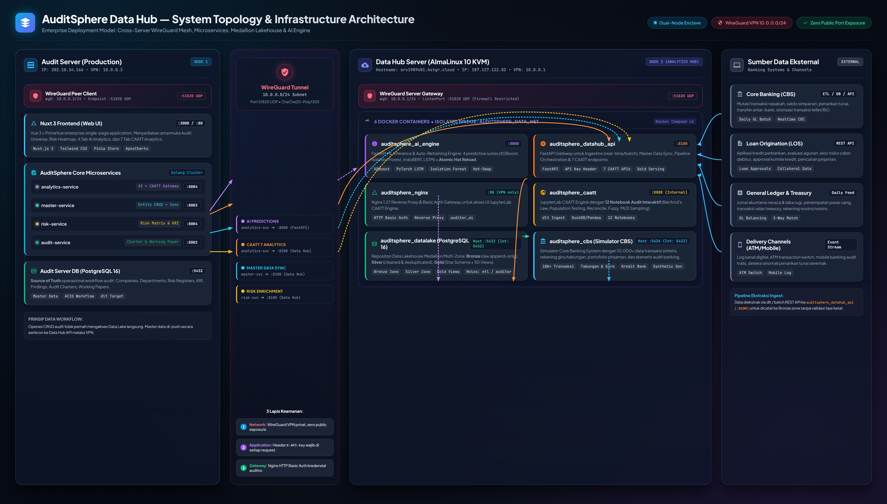
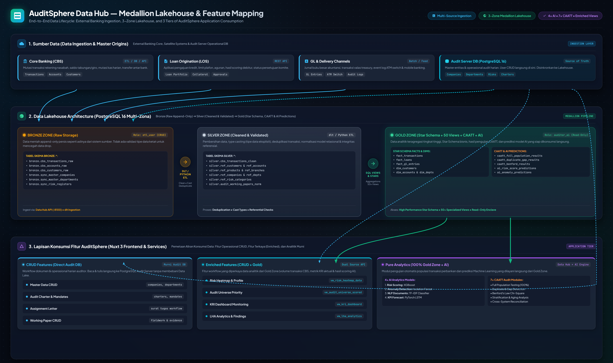

# AuditSphere Data Hub — Data Lake, AI Engine & CAATT Platform

Platform data analytics terpusat untuk **AuditSphere (PT Bina Audita Indonesia)**. Platform ini bertindak sebagai Data Lakehouse multi-zona (Bronze, Silver, Gold), engine CAATT (Computer Assisted Audit Techniques), pipeline ETL otomatis, dan AI Inference/Auto-Retrain Engine yang melayani kebutuhan analitik perbankan.

---

## 1. Arsitektur & Spesifikasi Server

### Target Deployment
* **OS:** AlmaLinux 10 (KVM Virtual Machine)
* **Hostname:** `srv1989481.hstgr.cloud`
* **IP Publik:** `187.127.122.82`
* **VPN IP (WireGuard):** `10.0.0.1/24`
* **Audit Server Peer:** `202.10.34.166` (`10.0.0.2/24`)

### Topologi Jaringan & Keamanan



```
┌─────────────────────────────────┐                 ┌─────────────────────────────────┐
│          Audit Server           │                 │      Data Hub Server (KVM)      │
│         202.10.34.166           │                 │          187.127.122.82         │
│          (10.0.0.2)             │                 │           (10.0.0.1)            │
│                                 │                 │                                 │
│  • Nuxt.js Frontend             │ WireGuard Tunnel│  • Nginx Gateway (:80)          │
│  • analytics-service (:8084)   │ ═══════════════ │  • Data Lake PG (:5433)         │
│  • master-service (:8003)       │  Port 51820 UDP │  • CBS Simulator PG (:5434)     │
│  • risk-service (:8004)         │   (Encrypted)   │  • Data Hub API (:8100)         │
│  • audit-service (:8002)        │                 │  • AI Engine (:8000)            │
│                                 │                 │  • JupyterLab CAATT (:8888)     │
└─────────────────────────────────┘                 └─────────────────────────────────┘
```

### 3 Lapis Keamanan
1. **Network (WireGuard VPN):** Port service (:8000, :8100, :5433, :5434) tidak di-expose ke internet publik. Hanya traffic melalui interface VPN privat `10.0.0.0/24` yang dapat mengakses API.
2. **Application (API Key Authentication):** Setiap request HTTP antar-server wajib menyertakan header `X-API-Key: <DATA_HUB_API_KEY>`.
3. **Gateway (HTTP Basic Auth):** Akses antarmuka JupyterLab CAATT Engine di-reverse proxy oleh Nginx dan dilindungi autentikasi kredensial pengguna auditor (`etl_user`, `auditor_ai`).

---

## 2. Struktur Komponen (Docker Containers)

| Container Name | Service | Port Internal | Fungsi |
|---|---|---|---|
| `auditsphere_nginx` | Nginx Proxy | `:80` | Reverse proxy & basic auth gateway untuk JupyterLab |
| `auditsphere_datalake` | PostgreSQL 16 | `:5432` (host :5433) | Repositori Data Lake multi-zona (Bronze, Silver, Gold) |
| `auditsphere_cbs_sim` | PostgreSQL 16 | `:5432` (host :5434) | Simulator Core Banking System (10K+ transaksi nasabah) |
| `auditsphere_datahub_api` | FastAPI | `:8100` | REST API ingest, serving Gold zone, sync master data, CAATT |
| `auditsphere_ai_engine` | FastAPI + ML | `:8000` | Inferensi AI (XGBoost, Isolation Forest, IndoBERT, LSTM) & Auto-Retrain |
| `auditsphere_caatt` | JupyterLab | `:8888` | CAATT Engine interaktif dengan 12 notebook audit |

---

## 3. Data Lake Architecture (3-Zone Medallion)



```
CBS / LOS / GL / Master Data
            │
            ▼
┌───────────────────────┐
│      BRONZE ZONE      │  Raw data, append-only, tanpa validasi tipe ketat.
│   (cbs_*, sync_*)     │  Menyimpan riwayat mentah transaksi perbankan.
└───────────┬───────────┘
            │ dlt / Python ETL (Cleaning, Type Casting, Deduplication)
            ▼
┌───────────────────────┐
│      SILVER ZONE      │  Cleaned & standardized relational models.
│   (cbs_*, ref_*)      │  Validasi referensial nasabah, akun, dan produk.
└───────────┬───────────┘
            │ SQL Aggregations & Analytics Transformations
            ▼
┌───────────────────────┐
│       GOLD ZONE       │  Star schema (fact & dimension tables) + 50+ views.
│ (fact_*, dim_*, caatt)│  Sumber analisis langsung untuk AI Engine & AuditSphere UI.
└───────────────────────┘
```

### Hak Akses Database Roles
* **`etl_user`**: Memiliki hak `CREATE`, `SELECT`, `INSERT`, `UPDATE`, `DELETE` di **semua zona** (`bronze`, `silver`, `gold`).
* **`auditor_ai`**: Memiliki hak **`SELECT` murni (Read-Only)** pada zona **`gold`**. Tidak dapat mengubah atau menghapus data.

---

## 4. Notebook CAATT Engine (JupyterLab)

Di dalam direktori `notebooks/`, tersedia 12 notebook audit berbantuan komputer:

1. **`00_etl_cbs_to_datalake.py`**: Pipeline ekstraksi data dari CBS Simulator ke zona Bronze, pembersihan ke Silver, dan agregasi ke Gold.
2. **`01_full_population_testing.py`**: Pengujian 100% populasi transaksi kredit terhadap batas plafon, pelampauan limit kas harian, dan limit valas.
3. **`02_duplicate_gap_detection.py`**: Identifikasi transaksi bernilai dan rekening identik dalam jeda waktu singkat serta nomor voucher GL / cek yang hilang berurutan.
4. **`03_benfords_law.py`**: Analisis frekuensi angka pertama transaksi menggunakan uji statistik Chi-Square untuk menemukan indikasi manipulasi pembukuan.
5. **`04_stratification_aging.py`**: Stratifikasi populasi ke dalam rentang nominal (<10M, 10-50M, 50-100M, >100M) dan analisis aging kolektibilitas kredit (Kol 1 - 5).
6. **`05_join_reconciliation.py`**: Rekonsiliasi otomatis 3-way matching antara Core Banking (CBS), General Ledger (GL), dan Loan Origination (LOS).
7. **`06_fuzzy_matching.py`**: Pencocokan fuzzy string Levenshtein untuk mendeteksi entitas ganda nasabah, vendor fiktif, atau benturan kepentingan karyawan.
8. **`07_sampling.py`**: Penarikan sampel statistik representatif: Simple Random, Stratified by Branch, Monetary Unit Sampling (MUS), dan Top-Value Selection.
9. **`08_continuous_monitoring.py`**: Monitoring berkelanjutan berbasis threshold: transaksi di luar jam operasional, rasio NPL cabang, dan fluktuasi penarikan kas.
10. **`09_data_profiling.py`**: Profiling kualitas data (Completeness %, Accuracy %, Timeliness, Duplikasi) di zona Bronze, Silver, dan Gold.
11. **`10_policy_rule_engine.py`**: Engine pengujian otomatis kebijakan perbankan: Batas Suku Bunga LPS, BMPK (Batas Maksimum Pemberian Kredit), dan Dual Control.
12. **`11_ai_anomaly_detection.py`**: Deteksi anomali tanpa pengawasan (Isolation Forest) pada data Gold zone yang hasilnya di-feed-back ke AI Engine untuk retraining siklus tertutup.

---

## 5. Endpoints Data Hub API (`:8100`)

Semua endpoint dilindungi header `X-API-Key`.

### Ingest & Serving
* `POST /api/v1/ingest/cbs-transaction`: Ingest transaksi real-time ke Bronze zone.
* `POST /api/v1/ingest/batch`: Ingest transaksi batch perbankan.
* `GET /api/v1/gold/transactions`: Mengambil fakta transaksi Gold zone dengan filtering.
* `GET /api/v1/gold/loans`: Mengambil portofolio kredit Gold zone.
* `GET /api/v1/gold/statistics`: Statistik agregat seluruh zona Data Lake.

### Master Data Sync
* `POST /api/v1/sync/master-data`: Sinkronisasi entitas (Companies, Departments, Employees, Risk Categories, Findings) dari Audit Server ke Bronze & Silver.
* `GET /api/v1/sync/master-data/status`: Status terakhir sinkronisasi master data.

### Pipeline Orchestration
* `POST /api/v1/pipeline/run`: Memicu eksekusi pipeline Bronze → Silver → Gold.
* `GET /api/v1/pipeline/status`: Status proses ETL terakhir.

### CAATT Analytics (Konsumsi Frontend AuditSphere)
* `GET /api/v1/caatt/full-population`: Hasil pengujian 100% populasi transaksi.
* `GET /api/v1/caatt/duplicate-gap`: Temuan transaksi duplikat dan celah nomor urut.
* `GET /api/v1/caatt/benford-analysis`: Hasil uji distribusi digit Hukum Benford.
* `GET /api/v1/caatt/stratification`: Distribusi transaksi berdasarkan strata nominal.
* `GET /api/v1/caatt/reconciliation`: Ringkasan kecocokan dan selisih rekonsiliasi lintas sistem.
* `GET /api/v1/caatt/policy-violations`: Daftar pelanggaran regulasi perbankan & BMPK.
* `GET /api/v1/caatt/data-quality`: Metrik kelengkapan, akurasi, dan latensi per tabel data lake.

---

## 6. AI Engine & Auto-Retraining (`:8000`)

AI Engine memuat 4 model prediktif berbasis machine learning:
1. **Department Risk Scoring:** XGBoost Regressor
2. **Transaction Anomaly Detection:** Isolation Forest
3. **Audit Finding Sentiment & NLP:** TF-IDF + Classifier (IndoBERT compatible)
4. **KPI Performance Trend:** PyTorch LSTM Regressor

### Auto-Retraining Mechanism
Ketika data baru masuk ke zona Gold (ditandai dengan `data_freshness_log`), scheduler internal memeriksa pembaruan setiap 6 jam atau via API trigger:
* Endpoint: `POST /retrain/auto`
* Engine mengevaluasi metrik akurasi model baru vs model lama.
* **Atomic Hot Reload:** Jika akurasi model baru lebih tinggi, model aktif diperbarui secara instan tanpa downtime. Jika tidak, model lama tetap dipertahankan.

---

## 7. Panduan Instalasi & Deployment

### Langkah 1: Setup Server Mandiri
Login ke server AlmaLinux 10 target:
```bash
ssh root@187.127.122.82
```
Clone atau salin berkas ke `/opt/auditsphere-data`:
```bash
mkdir -p /opt/auditsphere-data
cd /opt/auditsphere-data
# Salin setup_server.sh
chmod +x setup_server.sh
./setup_server.sh
```

### Langkah 2: Setup WireGuard VPN
1. **Di Data Hub Server (`187.127.122.82`):**
   ```bash
   cp wireguard/wg0-server.conf /etc/wireguard/wg0.conf
   # Isi SERVER_PRIVATE_KEY dan CLIENT_PUBLIC_KEY
   systemctl enable --now wg-quick@wg0
   ```
2. **Di Audit Server (`202.10.34.166`):**
   ```bash
   cp wireguard/wg0-client.conf /etc/wireguard/wg0.conf
   # Isi CLIENT_PRIVATE_KEY dan SERVER_PUBLIC_KEY
   systemctl enable --now wg-quick@wg0
   # Uji konektivitas
   ping 10.0.0.1
   ```

### Langkah 3: Konfigurasi Environment & Menjalankan Stack
```bash
cd /opt/auditsphere-data
cp .env.example .env
# Sesuaikan kata sandi, JUPYTER_TOKEN, dan API keys di .env
docker compose up -d --build
```

### Langkah 4: Migrasi Model Pre-trained
Salin model yang sudah dilatih dari development machine:
```bash
scp -r backend/python-ai/models/* root@187.127.122.82:/opt/auditsphere-data/ai-models/
```

### Langkah 5: Verifikasi Deployment
```bash
# 1. Cek semua 6 kontainer aktif
docker compose ps

# 2. Cek database Data Lake
docker exec -it auditsphere_datalake psql -U etl_user -d auditsphere_datalake -c "\dn"

# 3. Uji endpoint Data Hub API via VPN
curl -H "X-API-Key: dev-api-key" http://10.0.0.1:8100/health

# 4. Uji endpoint AI Engine via VPN
curl -H "X-API-Key: dev-ai-api-key" http://10.0.0.1:8000/health
```
