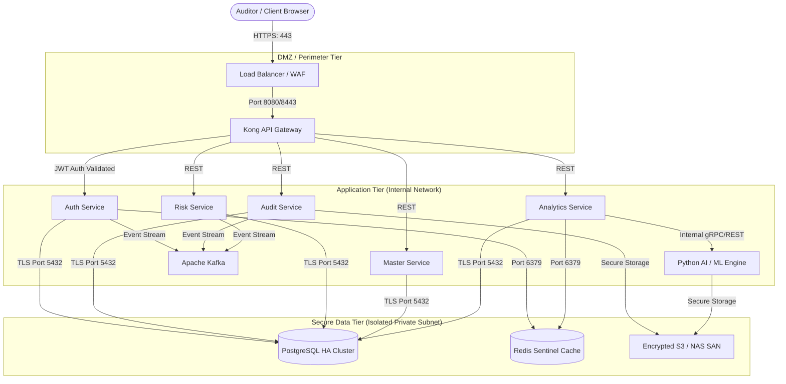
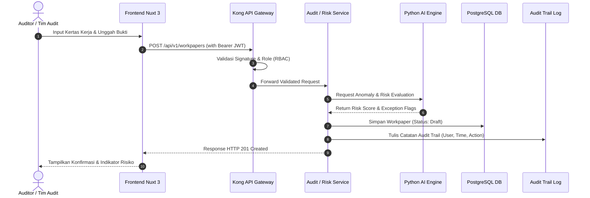
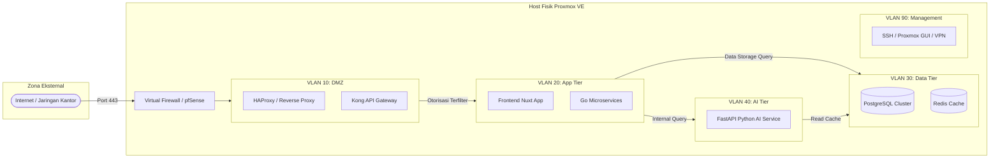

# DOKUMEN KESELARASAN ISO/IEC 27001:2022
## Alur Kerja Sistem & Pemetaan Kontrol Keamanan Informasi

**AIFL SERVICES**  
**AuditSphere — Risk-Based Internal Audit & ERM Platform**

* **Status**: DRAFT — untuk dilengkapi
* **Nomor Dokumen**: ISO-AS-001
* **Versi**: 0.1
* **Tanggal**: 11 September 2026
* **Klasifikasi**: Internal / Confidential

---

## Daftar Isi
- [1. Document Control](#1-document-control)
  - [1.1 Informasi Dokumen](#11-informasi-dokumen)
  - [1.2 Riwayat Revisi](#12-riwayat-revisi)
- [2. Tujuan & Ruang Lingkup](#2-tujuan--ruang-lingkup)
  - [2.1 Tujuan](#21-tujuan)
  - [2.2 Ruang Lingkup](#22-ruang-lingkup)
  - [2.3 Batasan / Pengecualian (Exclusions)](#23-batasan--pengecualian-exclusions)
- [3. Referensi & Definisi](#3-referensi--definisi)
  - [3.1 Referensi Standar](#31-referensi-standar)
  - [3.2 Istilah & Singkatan](#32-istilah--singkatan)
- [4. Konteks Organisasi & Aset Informasi](#4-konteks-organisasi--aset-informasi)
  - [4.1 Konteks Organisasi](#41-konteks-organisasi)
  - [4.2 Aset Informasi Utama](#42-aset-informasi-utama)
- [5. Gambaran Arsitektur Sistem](#5-gambaran-arsitektur-sistem)
  - [5.1 Ringkasan Arsitektur](#51-ringkasan-arsitektur)
  - [5.2 Batas Kepercayaan (Trust Boundary)](#52-batas-kepercayaan-trust-boundary)
- [6. Alur Kerja Proses Bisnis (Business Process Flow)](#6-alur-kerja-proses-bisnis-business-process-flow)
  - [6.1 Alur Onboarding Klien/Tenant](#61-alur-onboarding-klientenant)
  - [6.2 Alur Autentikasi & Otorisasi Pengguna](#62-alur-autentikasi--otorisasi-pengguna)
  - [6.3 Alur Continuous Auditing & Risk-Based Sampling](#63-alur-continuous-auditing--risk-based-sampling)
  - [6.4 Alur Automated Risk Scoring & Exception/Red-Flag Detection](#64-alur-automated-risk-scoring--exceptionred-flag-detection)
  - [6.5 Alur Digital Workpaper (Input → Review → Approval → Audit Trail)](#65-alur-digital-workpaper-input--review--approval--audit-trail)
  - [6.6 Alur Pelaporan & Dashboard AI/ML Analytics](#66-alur-pelaporan--dashboard-aiml-analytics)
  - [6.7 Alur Backup & Retensi Data](#67-alur-backup--retensi-data)
- [7. Pemetaan Kontrol Keamanan (Annex A Mapping)](#7-pemetaan-kontrol-keamanan-annex-a-mapping)
- [8. Kontrol Akses & Manajemen Identitas](#8-kontrol-akses--manajemen-identitas)
  - [8.1 Role & Permission Matrix](#81-role--permission-matrix)
  - [8.2 Kebijakan Autentikasi](#82-kebijakan-autentikasi)
  - [8.3 Review Akses Berkala](#83-review-akses-berkala)
- [9. Manajemen Risiko Keamanan Informasi](#9-manajemen-risiko-keamanan-informasi)
  - [9.1 Metodologi Penilaian Risiko](#91-metodologi-penilaian-risiko)
  - [9.2 Risk Register Sistem (Ringkasan)](#92-risk-register-sistem-ringkasan)
  - [9.3 Risk Treatment Plan](#93-risk-treatment-plan)
- [10. Keamanan Infrastruktur & Deployment](#10-keamanan-infrastruktur--deployment)
  - [10.1 Cloud/SaaS](#101-cloudsaas)
  - [10.2 On-Premises](#102-on-premises)
  - [10.3 Kontrol Jaringan](#103-kontrol-jaringan)
- [11. Manajemen Insiden Keamanan](#11-manajemen-insiden-keamanan)
  - [11.1 Prosedur Deteksi & Eskalasi](#111-prosedur-deteksi--eskalasi)
  - [11.2 Eskalasi ke Leadership](#112-eskalasi-ke-leadership)
  - [11.3 Klasifikasi Tingkat Keparahan Insiden](#113-klasifikasi-tingkat-keparahan-insiden)
- [12. Business Continuity & Disaster Recovery](#12-business-continuity--disaster-recovery)
  - [12.1 Target RTO/RPO](#121-target-rtorpo)
  - [12.2 Prosedur Backup & Restore](#122-prosedur-backup--restore)
  - [12.3 Skema High Availability (Roadmap)](#123-skema-high-availability-roadmap)
- [13. Kepatuhan & Audit Internal](#13-kepatuhan--audit-internal)
  - [13.1 Audit Trail](#131-audit-trail)
  - [13.2 Jadwal Audit Internal ISMS](#132-jadwal-audit-internal-isms)
  - [13.3 Kepatuhan GDPR & UU PDP](#133-kepatuhan-gdpr--uu-pdp)
- [14. Peran & Tanggung Jawab (RACI)](#14-peran--tanggung-jawab-raci)
- [15. Lampiran](#15-lampiran)
  - [15.1 Diagram Alur Data (Data Flow Diagram)](#151-diagram-alur-data-data-flow-diagram)
  - [15.2 Diagram Arsitektur Jaringan (VLAN Segmentation)](#152-diagram-arsitektur-jaringan-vlan-segmentation)
  - [15.3 Template Evidence / Audit Trail](#153-template-evidence--audit-trail)
  - [15.4 Glossary](#154-glossary)

---

## 1. Document Control

### 1.1 Informasi Dokumen

| Field | Isi |
| :--- | :--- |
| **Judul Dokumen** | Keselarasan ISO/IEC 27001 — Alur Kerja AuditSphere |
| **Nomor Dokumen** | `ISO-AS-001` |
| **Versi** | 0.1 (Draft) |
| **Status** | Draft |
| **Tanggal Berlaku** | [dd/mm/yyyy] |
| **Tanggal Review Berikutnya** | [dd/mm/yyyy] |
| **Klasifikasi** | Internal / Confidential |
| **Pemilik Dokumen (Document Owner)** | Lead Information Security / Tech Lead AIFL |
| **Reviewer** | Tim QA & Tim Infrastruktur AIFL |
| **Approver** | Dimas (Group Vision) |

### 1.2 Riwayat Revisi

| Versi | Tanggal | Deskripsi Perubahan | Diubah oleh |
| :--- | :--- | :--- | :--- |
| 0.1 | 11/09/2026 | Draft outline awal keselarasan arsitektur & proses bisnis dengan ISO/IEC 27001:2022 | Tim Security & Engineering |

> [!NOTE]
> **[STATUS/PLACEHOLDER]** Lengkapi tabel *document control* dan riwayat revisi sesuai dengan proses tata kelola dokumen internal AIFL.

---

## 2. Tujuan & Ruang Lingkup

### 2.1 Tujuan
Dokumen ini menjelaskan alur kerja (*workflow*) sistem **AuditSphere** dan bagaimana alur tersebut selaras dengan kontrol keamanan informasi berbasis standar **ISO/IEC 27001:2022**. Dokumen ini digunakan sebagai:
* **Acuan internal** untuk membangun, memelihara, dan mengoperasikan *Information Security Management System* (ISMS) pada ekosistem produk AuditSphere.
* **Referensi teknis** bagi tim implementasi, tim infrastruktur, dan tim pengembang (*software engineers*) dalam menjaga konsistensi penerapan kontrol keamanan informasi pada setiap siklus rilis.
* **Materi pendukung kepatuhan** (*compliance & assurance artifact*) yang dapat diajukan kepada pemangku kepentingan klien *enterprise* (*Chief Audit Executive*, Direktur Kepatuhan/MR, *Head of IT Security*) pada tahapan *due diligence* dan asesmen risiko vendor pihak ketiga.

### 2.2 Ruang Lingkup
Cakupan dokumen ini meliputi seluruh arsitektur dan modul operasional AuditSphere:
1. **Deployment Cloud/SaaS**: Arsitektur multi-tenant berbasis isolasi subdomain (`namaklien.auditsphere.io`), VPC terenkripsi, *managed database*, dan gateway otorisasi.
2. **Deployment On-Premises**: Lisensi *perpetual* dengan instalasi privat minimum 3 server fisik/virtual (*App/API Tier*, *Database/Storage Tier*, dan *AI/ML Analytics Tier*).
3. **Siklus Hidup Data Audit**: Pengumpulan data audit transaksi, pembentukan kertas kerja digital (*digital workpaper*), kalkulasi *risk scoring*, eksekusi analitik AI/ML, manajemen temuan, hingga pelaporan dan *audit trail*.

### 2.3 Batasan / Pengecualian (Exclusions)
> [!WARNING]
> **[STATUS/PLACEHOLDER]** AuditSphere saat ini berada pada fase **QA Remediation** (*Critical / Major / Minor / Trivial*). Kontrol yang bergantung pada modul yang masih dalam tahap remediasi wajib ditandai statusnya secara eksplisit di bagian terkait dan **TIDAK** dinyatakan sebagai *'Fully Compliant'* sampai remediasi selesai, diuji, dan diverifikasi secara formal.

* **Modul yang Dikecualikan**: Integrasi langsung ke core banking pihak ketiga yang belum tersertifikasi API Sandbox, serta fitur eksperimental *unsupervised deep clustering* yang masih berstatus lab/R&D.

---

## 3. Referensi & Definisi

### 3.1 Referensi Standar
* **ISO/IEC 27001:2022** — *Information Security Management Systems — Requirements*
* **ISO/IEC 27002:2022** — *Information Security Controls*
* **COSO ERM 2017** — *Enterprise Risk Management Framework*
* **IIA IPPF** — *International Professional Practices Framework (The Institute of Internal Auditors)*
* **ISACA ITAF** — *Information Technology Assurance Framework*
* **UU No. 27 Tahun 2022** tentang Pelindungan Data Pribadi (UU PDP Indonesia)
* **GDPR (EU 2016/679)** — *General Data Protection Regulation* (relevan bila terdapat subjek data Uni Eropa)

### 3.2 Istilah & Singkatan

| Istilah | Definisi |
| :--- | :--- |
| **RBIA** | *Risk-Based Internal Audit* (Metodologi audit internal berbasis prioritas risiko). |
| **ERM** | *Enterprise Risk Management* (Pengelolaan risiko perusahaan secara menyeluruh). |
| **ISMS** | *Information Security Management System* (Sistem Manajemen Keamanan Informasi / SMKI). |
| **DMZ** | *Demilitarized Zone* (Segmen jaringan perimeter yang memisahkan jaringan publik dan privat). |
| **VLAN** | *Virtual Local Area Network* (Segmentasi jaringan logis pada switch/hypervisor). |
| **RTO / RPO** | *Recovery Time Objective* (Batas toleransi downtime) / *Recovery Point Objective* (Batas toleransi kehilangan data). |
| **RACI** | *Responsible, Accountable, Consulted, Informed* (Matriks penugasan peran). |
| **CAE** | *Chief Audit Executive* (Pimpinan tertinggi fungsi audit internal). |
| **RBAC** | *Role-Based Access Control* (Pembatasan hak akses sistem berdasarkan peran kerja). |
| **MFA** | *Multi-Factor Authentication* (Verifikasi identitas berlapis). |

---

## 4. Konteks Organisasi & Aset Informasi

### 4.1 Konteks Organisasi
**AIFL Services** adalah penyedia solusi teknologi informasi komprehensif (*one-stop IT solution*) yang berfokus pada digitalisasi alur kerja (*workflow digitalization*), aplikasi proses bisnis enterprise, sistem monitoring & observability, serta konsultasi IT & keamanan siber.  
**AuditSphere** merupakan produk unggulan (*flagship product*) AIFL Services berupa platform *Risk-Based Internal Audit* (RBIA) dan *Enterprise Risk Management* (ERM) terintegrasi dengan kecerdasan buatan (*AI/ML-powered analytics*).

### 4.2 Aset Informasi Utama

| Aset Informasi | Deskripsi & Isi Aset | Klasifikasi | Pemilik Aset (*Data Owner*) |
| :--- | :--- | :--- | :--- |
| **Data Audit Klien** | Kertas kerja (*workpaper*), bukti temuan (*evidence*), notula wawancara, draf laporan audit. | **Confidential / Restricted** | Klien / CAE |
| **Hasil Risk Scoring & Exception Flag** | Kalkulasi matriks risiko, anomali transaksi, indikasi *fraud*, *red-flag alerts*. | **Confidential** | Unit Kerja Audit & Risk Management |
| **Kredensial Pengguna & Akses Sistem** | Password ter-hash (Argon2id/Bcrypt), API keys, JWT secret tokens, sertifikat TLS/SSL. | **Restricted** | Tim Security & IT Infrastructure |
| **Konfigurasi Infrastruktur** | Konfigurasi Proxmox VE, Kubernetes manifest, routing Kong Gateway, konfigurasi firewall & VLAN. | **Internal / Restricted** | Tim Infrastructure & DevOps |
| **Kode Sumber AuditSphere** | Repositori backend Go, service Python AI, frontend Nuxt 3, migration scripts. | **Confidential** | Tim Development / Engineering Lead |
| **Log Audit Trail Sistem** | Log aktivitas pengguna (*who, when, what*), log autentikasi, log perubahan status workpaper. | **Confidential** | Tim Keamanan Informasi & Compliance |
| **Data Tenant (Multi-Tenant Cloud)** | Metadata organisasi, relasi user-tenant, skema database terisolasi. | **Confidential / Restricted** | Product Owner & Cloud Lead |

> [!NOTE]
> **[STATUS/PLACEHOLDER]** Klasifikasi di atas merupakan usulan awal — perlu divalidasi dan diselaraskan secara berkala dengan skema klasifikasi data resmi AIFL dan kebijakan privasi klien.

---

## 5. Gambaran Arsitektur Sistem

### 5.1 Ringkasan Arsitektur
AuditSphere dibangun menggunakan arsitektur *microservices* modern yang tangguh dan modular:
* **Frontend**: Nuxt 3 / Vue 3 (Nuxt UI, Tailwind CSS, Pinia state management).
* **API Gateway & Security**: Kong Gateway (reverse proxy, TLS termination, JWT rate limiting).
* **Backend Microservices (Go)**:
  * `auth-service`: Autentikasi, manajemen user/role, refresh token, MFA.
  * `audit-service`: Manajemen audit charter, program audit, digital workpaper, temuan audit.
  * `risk-service`: Risk universe, register risiko, kalkulasi inherent/residual risk.
  * `master-service`: Master data organisasi, auditee, referensi regulasi.
  * `analytics-service`: Agregasi metrik, dashboard, dan konektor analitik.
* **AI/ML Service (Python)**: FastAPI, Scikit-Learn, PyTorch, IndoBERT, XGBoost, Isolation Forest (untuk *anomaly detection*, *automated risk scoring*, dan *sampling* cerdas).
* **Databases & Message Broker**: PostgreSQL 16 (Patroni HA), Redis 7 (Cache/Session), Apache Kafka (Audit Event Streaming).

Model *deployment* yang didukung:
1. **Cloud / SaaS**: Multi-tenant terisolasi berbasis subdomain (`[klien].auditsphere.io`), hosted pada cloud provider berlokasi domestik (misal AWS Jakarta Region `ap-southeast-3`).
2. **On-Premises**: Lisensi *perpetual* pada infrastruktur privat klien dengan konfigurasi minimum 3 server fisik/virtual.

### 5.2 Batas Kepercayaan (*Trust Boundary*)
Batas keamanan jaringan dan aliran data diatur ke dalam beberapa *tier*:
1. **DMZ / Ingress Tier**: Menerima request eksternal dari browser auditor melalui HTTPS (port 443), diinspeksi oleh WAF/Load Balancer, lalu diteruskan ke Kong API Gateway.
2. **App/API Tier**: Berisi *pod / container* backend microservices Go dan Frontend SSR. Menangani *business logic* dan validasi izin akses (RBAC).
3. **Database Tier**: PostgreSQL dan Redis yang terisolasi total dalam subnet privat tanpa akses internet langsung; hanya dapat diakses oleh microservices melalui koneksi terautentikasi dan terenkripsi.
4. **AI/ML Tier**: Service `python-ai` yang memproses beban inferensi dan scoring. Menjalankan model secara lokal/offline (*air-gapped compatible*).

> [!CAUTION]
> **[STATUS/PLACEHOLDER] Anti-Pattern yang Harus Dihindari**:
> 1. API Gateway diposisikan **setelah** (bukan sebelum) Application Server.
> 2. Koneksi langsung dari API Gateway ke Database yang melewati *business logic*.
> 3. Frontend mengakses langsung database atau service AI tanpa melalui otorisasi Gateway.



---

## 6. Alur Kerja Proses Bisnis (*Business Process Flow*)

### 6.1 Alur Onboarding Klien/Tenant
1. **Registrasi & Verifikasi**: Permintaan onboarding diproses oleh Sales/Ops → verifikasi identitas organisasi dan legalitas.
2. **Provisioning Tenant**:
   * *Cloud*: Pembuatan subdomain terisolasi (`klien.auditsphere.io`), inisialisasi skema database tenant, dan alokasi *storage bucket*.
   * *On-Premises*: Penyiapan VM/Server sesuai *baseline hardening*, instalasi paket release via Helm/Docker Compose.
3. **Konfigurasi Akun Administrator**: Pembuatan kredensial root tenant admin awal dengan kewajiban ganti password saat login pertama kali dan aktivasi MFA.
4. **Titik Kontrol Keamanan**:
   * Verifikasi identitas admin melalui *out-of-band communication*.
   * Isolasi skema data tenant (*tenant isolation enforcement*).
   * Verifikasi *baseline security hardening* OS dan container sebelum *handover*.

### 6.2 Alur Autentikasi & Otorisasi Pengguna
1. **Login Request**: Pengguna memasukkan username, password, dan kode OTP MFA ke frontend Nuxt.
2. **Validasi & Penerbitan Token**: `auth-service` memverifikasi hash kredensial (Argon2/Bcrypt) dan OTP. Jika valid, diterbitkan pasangan token:
   * `Access Token` (JWT, masa berlaku 15–30 menit, ditandatangani RS256/HS256).
   * `Refresh Token` (disimpan terenkripsi di HTTP-Only cookie, masa berlaku 7 hari dengan mekanisme rotasi).
3. **Pemberlakuan RBAC**: Setiap request ke API divalidasi oleh Kong Gateway dan service backend berdasarkan *claims* peran (*Chief Audit Executive, Lead Auditor, Auditor, Reviewer, System Admin*).
4. **Titik Kontrol Keamanan**:
   * Kebijakan *password complexity* (minimal 12 karakter, kombinasi alfanumerik & simbol).
   * Proteksi *brute-force* (penguncian akun setelah 5 percobaan gagal berturut-turut).
   * *Session idle timeout* otomatis (15 menit ketidakaktifan).
   * Pencatatan log autentikasi lengkap (IP, User-Agent, Timestamp, Status Sukses/Gagal).

### 6.3 Alur Continuous Auditing & Risk-Based Sampling
1. **Penerimaan Data Transaksi**: Ingestion data auditee/transaksi melalui batch upload file (CSV/Excel) atau API integration.
2. **Validasi & Pembersihan**: Data disanitasi dari karakter berbahaya (*input validation & sanitization*).
3. **Eksekusi Sampling Engine**: Algoritma statistik dan rule-based memilih sampel transaksi berdasarkan bobot risiko (*risk weight*), stratifikasi nilai nominal, dan parameter ambang batas.
4. **Titik Kontrol Keamanan**:
   * Validasi integritas file (pengecekan checksum SHA-256).
   * Pembatasan hak akses untuk mengubah parameter & algoritma sampling hanya untuk Lead Auditor / CAE.
   * Pencatatan log pemilihan sampel yang tidak dapat diubah (*immutable log*).

### 6.4 Alur Automated Risk Scoring & Exception/Red-Flag Detection
1. **Pipeline Analitik AI/ML**: `analytics-service` meneruskan data transaksi ke `python-ai`.
2. **Deteksi Anomali & Scoring**: Model Machine Learning (Isolation Forest & XGBoost) mendeteksi deviasi pola transaksi, frekuensi tidak wajar, atau duplikasi terselubung. Model IndoBERT menganalisis narasi keterangan transaksi.
3. **Pemberian Flag & Skor**: Sistem menghasilkan skor risiko (1–100) dan menandai status *red-flag/exception* secara otomatis.
4. **Titik Kontrol Keamanan**:
   * *Model Explainability*: Hasil scoring disertai faktor kontributor (*SHAP values*) agar tidak menjadi *black box*.
   * Audit trail penuh atas input model, versi model yang digunakan, dan skor output.
   * Isolasi jaringan: Service AI tidak memiliki akses keluar (*no egress to external internet*) saat inferensi.

### 6.5 Alur Digital Workpaper (Input → Review → Approval → Audit Trail)
1. **Input Kertas Kerja**: Auditor mendokumentasikan prosedur pengujian, narasi temuan, akar penyebab, dampak, dan mengunggah bukti pendukung (*evidence*).
2. **Review Berjenjang**: Workpaper disubmit ke Lead Auditor / Reviewer untuk diuji kelengkapannya.
3. **Pemberian Catatan / Revisi**: Reviewer memberikan catatan (*coaching notes*) secara transparan dalam sistem.
4. **Approval Final**: CAE atau Audit Manager menyetujui workpaper secara digital.
5. **Locking & Non-Repudiation**: Setelah status berubah menjadi *Approved*, workpaper terkunci secara permanen (*read-only*) dan ditandatangani digital.
6. **Titik Kontrol Keamanan**:
   * *Granular Version Control*: Setiap draf dan revisi tersimpan versinya.
   * *Immutable Audit Trail*: Seluruh aksi (*create, edit, delete attachment, review, approve*) tercatat dengan timestamp tersinkronisasi NTP.
   * Enkripsi dokumen lampiran bukti audit pada *storage tier* menggunakan AES-256.

### 6.6 Alur Pelaporan & Dashboard AI/ML Analytics
1. **Agregasi Data**: Modul analytics menarik data status audit, temuan terbuka, risiko residual, dan matriks tindak lanjut.
2. **Visualisasi Berbasis Peran**:
   * Level Eksekutif (Direksi & Komite Audit): Ringkasan makro tren risiko, status kesehatan kontrol internal.
   * Level Operasional: Detail temuan dan progres rekomendasi audit.
3. **Pencegahan Kebocoran Data**: Data masking diterapkan otomatis pada informasi sensitif (PII auditee, NIK, nomor rekening) sesuai izin peran pengguna.
4. **Titik Kontrol Keamanan**:
   * Kontrol ekspor laporan (PDF/Excel) dilengkapi *dynamic watermark* berisi identitas user dan timestamp pengunduhan.
   * Pembatasan izin ekspor hanya untuk peran yang berwenang.

### 6.7 Alur Backup & Retensi Data
1. **Eksekusi Backup Terjadwal**:
   * Backup Database harian secara inkremental dan mingguan secara penuh (*full dump*).
   * Backup berkas dokumen kertas kerja digital ke *secondary object storage*.
2. **Enkripsi Backup**: File cadangan dienkripsi menggunakan AES-256 / GPG sebelum dikirim ke repositori backup terpisah.
3. **Retensi & Pemusnahan Data**: Data audit disimpan sesuai kebijakan retensi (minimal 5–10 tahun sesuai regulasi sektor keuangan), setelah itu dilakukan penghapusan aman (*secure sanitization*).
4. **Titik Kontrol Keamanan**:
   * Uji pemulihan data (*restore testing*) dilakukan secara berkala (minimal triwulanan).
   * Hak akses file backup dipisahkan secara ketat dari hak akses operasional harian (*segregation of duties*).

---

## 7. Pemetaan Kontrol Keamanan (Annex A Mapping)

Berikut adalah pemetaan klausul kontrol **ISO/IEC 27001:2022 Annex A** terhadap implementasi pada sistem dan tata kelola AuditSphere:

| Klausul ISO 27001:2022 | Kontrol Keamanan Informasi | Implementasi pada AuditSphere | Status Implementasi |
| :--- | :--- | :--- | :--- |
| **A.5.1 s/d A.5.8** | Kebijakan & Tata Kelola Keamanan Informasi | Dokumen kebijakan akses, penggunaan sistem AuditSphere, dan standar pengamanan data audit internal. | **Partially Implemented** *(Proses penyusunan SOP internal)* |
| **A.5.9 s/d A.5.14** | Manajemen Aset & Klasifikasi Data | Penetapan skema klasifikasi data (*Public, Internal, Confidential, Restricted*) untuk kertas kerja, bukti audit, dan kredensial. | **Partially Implemented** |
| **A.5.15 s/d A.5.18** | Kontrol Akses & Identitas | Implementasi RBAC 5-tingkat, MFA wajib untuk privileged user, session timeout, pemutusan akses otomatis. | **Implemented** |
| **A.8.24** | Penggunaan Kriptografi | Enkripsi data *in-transit* (TLS 1.3 / HTTPS) dan data *at-rest* (AES-256 pada PostgreSQL dan storage). | **Implemented** |
| **A.8.15 & A.8.16** | Logging & Monitoring Aktivitas | Perekaman audit trail bawaan pada setiap perubahan data, sentralisasi log, proteksi log dari modifikasi. | **Implemented** |
| **A.8.20 s/d A.8.22** | Keamanan Jaringan & Segmentasi | Segmentasi VLAN (DMZ, App, Data, AI, Management), pemisahan subnet, pembatasan port melalui firewall. | **Implemented** |
| **A.8.25 s/d A.8.34** | Keamanan Siklus Hidup Pengembangan (SDLC) | Peninjauan kode (*code review*), secure coding guidelines, SAST/DAST, dan proses remediasi bug QA. | **In Progress** *(Dalam fase QA Remediation)* |
| **A.5.24 s/d A.5.28** | Manajemen Insiden Keamanan Informasi | SOP respons insiden, alur eskalasi ke leadership menggunakan format Leadership OS AIFL (Bab 11). | **Partially Implemented** |
| **A.5.29 & A.5.30** | Kesiapan Kelangsungan Bisnis (BCM/DR) | Strategi cadangan berkala, failover database Patroni, target RTO/RPO terukur (Bab 12). | **In Progress** |
| **A.5.31 s/d A.5.34** | Kepatuhan Hukum & Kontraktual | Keselarasan dengan UU PDP No. 27/2022, residensi data lokal (AWS Jakarta / on-premise), kepatuhan IIA/ISACA. | **Implemented** |

> [!IMPORTANT]
> **[STATUS/PLACEHOLDER]** Status wajib diperbarui secara berkala dengan opsi: `Implemented`, `Partially Implemented`, `In Progress`, `Not Yet Implemented`, atau `Not Applicable` berdasarkan hasil verifikasi audit QA independen.

---

## 8. Kontrol Akses & Manajemen Identitas

### 8.1 Role & Permission Matrix

| Role | Hak Akses Utama | Batasan & Catatan |
| :--- | :--- | :--- |
| **Chief Audit Executive (CAE)** | Akses penuh dashboard analitik, persetujuan akhir (*final approval*) Rencana Kerja Audit Tahunan (PKAT), audit charter, dan laporan audit final. | Tidak melakukan input teknis kertas kerja harian; otorisasi tingkat tertinggi. |
| **Audit Manager / Lead Auditor** | Menyusun program audit, menugaskan auditor, mereview workpaper, memberikan coaching notes, dan menyetujui temuan. | Tidak dapat mengubah audit trail log; hak approve sebelum CAE. |
| **Auditor / Field Auditor** | Input kertas kerja digital (*workpaper*), mengunggah bukti audit, menjalankan sampling data, mencatat temuan sementara. | Hanya dapat mengedit workpaper miliknya yang berstatus *Draft/In-Progress*. |
| **System Administrator** | Manajemen user (tambah/nonaktifkan), konfigurasi tenant, monitoring resource server, konfigurasi integrasi sistem. | **Tidak memiliki akses** untuk melihat atau memodifikasi konten kertas kerja audit (*segregation of duties*). |
| **Auditee (Client Representative)** | Mengunggah dokumen tindak lanjut rekomendasi audit, memberikan tanggapan manajemen (*management response*). | Akses dibatasi hanya pada modul temuan yang relevan dengan unit kerjanya. |

### 8.2 Kebijakan Autentikasi
1. **Kebijakan Password**:
   * Panjang minimal 12 karakter.
   * Wajib memuat kombinasi huruf besar, huruf kecil, angka, dan karakter khusus/simbol.
   * Masa berlaku password maksimal 90 hari (*password expiration*).
   * Pencegahan penggunaan ulang 5 riwayat password terakhir.
2. **Multi-Factor Authentication (MFA)**:
   * Wajib diaktifkan untuk peran *System Administrator*, *CAE*, dan *Audit Manager*.
   * Menggunakan standar Time-based One-Time Password (TOTP via Google Authenticator / Microsoft Authenticator).
3. **Session Management & Account Lockout**:
   * *Session Idle Timeout*: Pengguna otomatis logout setelah 15 menit tanpa aktivitas.
   * *Account Lockout*: Akun terkunci otomatis selama 30 menit setelah 5 kali gagal memasukkan kata sandi berturut-turut.
   * *Concurrent Login Limitation*: Pembatasan 1 sesi aktif per akun pengguna untuk mencegah penggunaan kredensial bersama (*shared account*).

### 8.3 Review Akses Berkala
* **Frekuensi Review**: Dilaksanakan secara **triwulanan (quarterly)** oleh Tim Keamanan Informasi bersama Pimpinan Tim Audit.
* **Prosedur**:
  * Pengecekan status kepegawaian (pencabutan hak akses segera bagi karyawan yang mutasi atau *resign*).
  * Evaluasi kesesuaian peran aktif vs izin akses aktual di sistem.
  * Penonaktifan akun yang tidak aktif selama lebih dari 60 hari secara otomatis.

---

## 9. Manajemen Risiko Keamanan Informasi

### 9.1 Metodologi Penilaian Risiko
Penilaian risiko keamanan informasi sistem AuditSphere menggunakan matriks **Likelihood (Kemungkinan)** × **Impact (Dampak)** dengan skala 5×5:
* **Tingkat Kemungkinan (1–5)**: *Rare, Unlikely, Moderate, Likely, Almost Certain*.
* **Tingkat Dampak (1–5)**: *Insignificant, Minor, Moderate, Major, Catastrophic* (dinilai dari aspek Kerahasiaan, Integritas, dan Ketersediaan).
* **Kategori Tingkat Risiko**:
  * **Low (1–4)**: Diterima dengan monitoring rutin.
  * **Medium (5–9)**: Mitigasi dengan kontrol operasional berkala.
  * **High (10–14)**: Memerlukan penanganan prioritas dan persetujuan Technical Lead.
  * **Critical (15–25)**: Memerlukan tindakan mitigasi segera dan eskalasi ke Leadership (Dimas, Group Vision).

### 9.2 Risk Register Sistem (Ringkasan)

| ID Risiko | Deskripsi Risiko | Kategori | Likelihood | Impact | Tingkat Risiko | Status Mitigasi |
| :--- | :--- | :--- | :--- | :--- | :--- | :--- |
| **RSK-01** | Kerentanan keamanan pada modul yang masih dalam fase QA Remediation | Teknis / SDLC | Moderate (3) | Major (4) | **High (12)** | **In Progress** *(Remediasi terjadwal)* |
| **RSK-02** | Kebocoran data audit sensitif antar-tenant pada arsitektur cloud multi-tenant | Keamanan Data | Unlikely (2) | Catastrophic (5) | **High (10)** | **Implemented** *(Enkripsi & isolasi skema DB)* |
| **RSK-03** | Kegagalan pemulihan database saat terjadi *hardware crash* pada on-premise | Infrastruktur | Unlikely (2) | Major (4) | **Medium (8)** | **In Progress** *(Automasi uji restore)* |
| **RSK-04** | Akses tidak sah akibat kompromi kredensial admin | Akses Kontrol | Unlikely (2) | Major (4) | **Medium (8)** | **Implemented** *(Penerapan TOTP MFA & Lockout)* |
| **RSK-05** | Degradasi performa analitik AI/ML akibat lonjakan volume data transaksi | Kinerja Sistem | Moderate (3) | Moderate (3) | **Medium (9)** | **In Progress** *(Optimasi antrean Kafka)* |

### 9.3 Risk Treatment Plan
1. **Penyelesaian QA Remediation (RSK-01)**: Melakukan patching menyeluruh terhadap temuan vulnerability scanner sebelum rilis versi mayor; pengujian regresi otomatis via CI/CD pipeline. Target: Siklus rilis berjalan.
2. **Penguatan Multi-Tenancy Guardrail (RSK-02)**: Audit berkala pada konfigurasi middleware tenant isolation dan pengujian *penetration testing* spesifik *cross-tenant data leakage*. Target: Setiap rilis major.
3. **Otomatisasi Uji Pemulihan BCP/DR (RSK-03)**: Menjalankan skrip validasi restore mingguan di lingkungan staging untuk memastikan validitas snapshot backup. Target: Q4 2026.

---

## 10. Keamanan Infrastruktur & Deployment

### 10.1 Cloud/SaaS
* **Isolasi Tenant**: Menggunakan pendekatan *logical separation* dengan *schema-per-tenant* atau *isolated tenant ID partitioning* pada PostgreSQL, didukung routing domain `[klien].auditsphere.io`.
* **Proteksi Jaringan & TLS**: Seluruh komunikasi eksternal dan internal dilindungi TLS 1.3. Integrasi Cloudflare/AWS WAF untuk mitigasi serangan DDoS dan OWASP Top 10.
* **Residensi Data**: Menjamin seluruh data operasional dan cadangan disimpan di pusat data wilayah hukum Indonesia (AWS Jakarta Region `ap-southeast-3`).

### 10.2 On-Premises
* **Konfigurasi Minimum 3 Server Fisik/VM**:
  1. **Server 1 (App/API Tier)**: Kong API Gateway, Frontend Nuxt, Go Microservices.
  2. **Server 2 (Database & State Tier)**: PostgreSQL HA, Redis, Apache Kafka.
  3. **Server 3 (AI/ML Tier)**: Python AI Service, Model Storage, Heavy Analytics Processing.
* **Virtualisasi Berbasis Proxmox VE**:
  * Penggunaan kernel Linux ter-hardening, isolasi KVM/LXC container.
  * Backup VM otomatis pada level hypervisor ke dedicated NAS/SAN storage.
* **Segmentasi Jaringan VLAN**:
  * `VLAN 10 - DMZ / Ingress`: Reverse Proxy, Load Balancer eksternal.
  * `VLAN 20 - App Network`: Microservices Go, Frontend Nuxt.
  * `VLAN 30 - Data Network`: PostgreSQL, Redis, Kafka (terisolasi ketat).
  * `VLAN 40 - AI Network`: Engine Python AI/ML.
  * `VLAN 90 - Management`: Port SSH, Proxmox Web GUI, IPMI (hanya bisa diakses via VPN Admin).

> [!WARNING]
> **[STATUS/PLACEHOLDER] Catatan Khusus On-Premises**: USB tethering hanya diizinkan secara terbatas untuk instalasi awal/bootstrap Proxmox jika mutlak diperlukan, dan **DILARANG KERAS** dibiarkan terpasang pada operasional produksi.

### 10.3 Kontrol Jaringan
* **Firewall Rules (Default-Deny)**: Seluruh port inbound ditutup secara default kecuali yang secara eksplisit didefinisikan (Port 443 untuk Web/API).
* **Akses Antar-VLAN**: Komunikasi hanya diperbolehkan satu arah dari *App VLAN* ke *Data VLAN* (Port 5432 & 6379) dan *AI VLAN* (Port 8000). Data VLAN dilarang menginisiasi koneksi keluar (*outbound blocking*).
* **Intrusion Detection/Prevention (IDS/IPS)**: Penerapan Snort/Suricata atau CrowdSec pada ingress gateway untuk mendeteksi pemindaian port dan anomali traffic jaringan.

---

## 11. Manajemen Insiden Keamanan

### 11.1 Prosedur Deteksi & Eskalasi
1. **Deteksi**: Insiden teridentifikasi melalui alert sistem monitoring (Prometheus/Grafana), notifikasi IDS/IPS, laporan temuan QA, atau laporan pengguna (*security report ticket*).
2. **Triage Awal**: Tim Security/Ops melakukan verifikasi dalam waktu < 15 menit untuk mengonfirmasi validitas insiden (*true positive* vs *false positive*).
3. **Isolasi & Penahanan (*Containment*)**:
   * Memutus koneksi instance terdampak dari jaringan produksi.
   * Melakukan revocations pada token atau kredensial yang diduga terkompromi.
4. **Investigasi & Analisis Forensik**: Meneliti log audit trail, log akses, dan dump memori untuk mengetahui *root cause*.
5. **Pemulihan (*Eradication & Recovery*)**: Menerapkan patch keamanan, memulihkan data dari backup terverifikasi bersih, dan membuka kembali layanan.

### 11.2 Eskalasi ke Leadership
Insiden dengan dampak signifikan (*Major* atau *Critical*) **wajib segera dieskalasikan** kepada **Dimas (Group Vision)** dengan menggunakan standar format komunikasi **Leadership OS AIFL**:

```text
[LEADERSHIP OS INCIDENT BRIEFING FORMAT]

1. CONTEXT        : Latar belakang singkat sistem/komponen yang terdampak dan waktu kejadian.
2. PROBLEM        : Deskripsi jelas mengenai insiden keamanan yang terjadi.
3. IMPACT         : Dampak aktual & potensial terhadap data klien, reputasi, operasional, dan kepatuhan.
4. OPTIONS        : 2–3 opsi tindakan mitigasi yang dapat diambil beserta kelebihan & kekurangannya.
5. RECOMMENDATION : Rekomendasi tindakan terbaik dari Tim Keamanan & Engineering.
6. DECISION       : Keputusan atau arahan persetujuan yang dibutuhkan dari Leadership.
```

### 11.3 Klasifikasi Tingkat Keparahan Insiden

| Tingkat (*Severity*) | Kriteria & Contoh Insiden | Target Waktu Respons (*SLA*) |
| :--- | :--- | :--- |
| **Critical** | Kebocoran data rahasia klien (*data breach*), sistem lumpuh total (*total outage*), kompromi akun root/admin, ransomware. | **< 15 Menit** (Eskalasi segera ke Group Vision) |
| **Major** | Kerentanan high-severity aktif tereksploitasi, kegagalan fungsi modul inti audit, anomali akses lintas tenant yang tertahan. | **< 1 Jam** |
| **Minor** | Percobaan brute force yang berhasil diblokir, bug UI non-kritis, kegagalan pengiriman notifikasi email audit. | **< 4 Jam** |

---

## 12. Business Continuity & Disaster Recovery

### 12.1 Target RTO/RPO

| Komponen Sistem | Target RTO (*Recovery Time Objective*) | Target RPO (*Recovery Point Objective*) |
| :--- | :--- | :--- |
| **Core Database (PostgreSQL)** | < 1 Jam | < 15 Menit (Replikasi WAL berkala) |
| **Application Services (Go & Nuxt)** | < 30 Menit | 0 (Stateless - Deploy ulang dari image) |
| **AI/ML Analytics Service** | < 2 Jam | < 1 Jam (State model pre-trained) |
| **File Storage / Bukti Kertas Kerja** | < 2 Jam | < 1 Jam (Sinkronisasi bucket/storage) |

### 12.2 Prosedur Backup & Restore
* **Jadwal Pencadangan**:
  * *Database*: Snapshot harian otomatis pada pukul 02:00 WIB + continuous archiving transaction logs.
  * *Storage Bukti Audit*: Sinkronisasi berkala harian ke secondary backup vault.
* **Pengujian Pemulihan (*Drill Test*)**: Simulasi pemulihan disaster recovery dilaksanakan minimal **1 kali setiap 6 bulan** untuk memvalidasi integritas data cadangan dan kesiapan tim teknis.

### 12.3 Skema High Availability (Roadmap)
> [!NOTE]
> **[STATUS/PLACEHOLDER] Skema High Availability (HA)**:
> Standar minimum arsitektur HA mencakup redundansi minimum **2 unit fisik/virtual per komponen kritikal** (Active-Passive Load Balancer, Patroni PostgreSQL Cluster dengan 1 Primary + 1 Standby Replicas, Redis Sentinel).
> *Saat ini berstatus **Roadmap Terencana**: dimulai dari implementasi HA berbasis VM/Virtualisasi, lalu bermigrasi ke bare-metal dedicated multi-node seiring dengan pertumbuhan basis klien enterprise.*

---

## 13. Kepatuhan & Audit Internal

### 13.1 Audit Trail
Sistem AuditSphere dirancang dengan prinsip *Compliance by Design*:
* Memiliki fitur pencatatan audit trail bawaan (*built-in audit logging*) yang mencakup setiap interaksi pada kertas kerja digital, perubahan skor risiko, ekspor laporan, dan manipulasi data master.
* Selaras dengan standar praktik audit internasional: **IIA IPPF Standard 1220** (*Due Professional Care*) dan standar jaminan IT **ISACA ITAF**.

### 13.2 Jadwal Audit Internal ISMS
* **Frekuensi**: Audit Internal Keamanan Informasi (ISMS) dilakukan minimal **1 kali setiap tahun (annual audit)** atau setiap ada perubahan arsitektur mayor.
* **Pelaksana**: Tim Auditor Internal Independen AIFL yang telah memiliki sertifikasi ISO 27001 Lead Auditor / CISA.

### 13.3 Kepatuhan GDPR & UU PDP (UU No. 27/2022)
* **Hak Subjek Data**: AuditSphere menyediakan fitur untuk memenuhi hak subjek data (hak perbaikan data, penarikan persetujuan, dan penghapusan data jika diizinkan oleh regulasi audit).
* **Dasar Hukum Pemrosesan**: Pemrosesan data transaksi dilakukan berdasarkan dasar kewajiban hukum (*legal obligation*) dan pelaksanaan tugas audit resmi (*legitimate interest/audit mandate*).
* **Transfer Data Lintas Batas**: Data klien Indonesia dijamin tidak ditransfer ke luar yurisdiksi Republik Indonesia tanpa persetujuan eksplisit dan pemenuhan klausul transfer data UU PDP.

---

## 14. Peran & Tanggung Jawab (RACI)

| Aktivitas | Development | Infra / Proxmox | Security | QA |
| :--- | :---: | :---: | :---: | :---: |
| **Pengembangan Fitur Baru** | **R / A** | C | C | I |
| **Konfigurasi Jaringan & VLAN** | I | **R / A** | C | I |
| **Penilaian Risiko Keamanan** | C | C | **R / A** | I |
| **QA Remediation & Bug Fixing** | **R** | I | C | **R / A** |
| **Respons Insiden Keamanan** | C | R | **R / A** | I |

*Keterangan Matriks RACI:*
* **R (Responsible)**: Pihak yang mengerjakan tugas secara langsung.
* **A (Accountable)**: Pihak yang memiliki wewenang penuh dan bertanggung jawab atas hasil akhir.
* **C (Consulted)**: Pihak yang dimintai pendapat atau keahliannya dalam proses pengerjaan.
* **I (Informed)**: Pihak yang selalu mendapatkan informasi pembaruan status pengerjaan.

---

## 15. Lampiran

### 15.1 Diagram Alur Data (Data Flow Diagram)



### 15.2 Diagram Arsitektur Jaringan (VLAN Segmentation)



### 15.3 Template Evidence / Audit Trail
Berikut adalah struktur standar pencatatan riwayat audit (*audit trail schema*) yang dijamin integritasnya:

```json
{
  "event_id": "evt-9b1deb4d-3b7d-4bad-9bdd-2b0d7b3dcb6d",
  "timestamp": "2026-09-11T00:15:30.124Z",
  "actor": {
    "user_id": "usr-1042",
    "username": "auditor.utama@klien.co.id",
    "role": "Auditor",
    "ip_address": "192.168.20.45",
    "user_agent": "Mozilla/5.0 (Macintosh; Intel Mac OS X 10_15_7)..."
  },
  "action": "WORKPAPER_SUBMIT_REVIEW",
  "target_resource": {
    "module": "AUDIT_EXECUTION",
    "entity_type": "workpaper",
    "entity_id": "wp-2026-q3-009"
  },
  "changes": {
    "previous_status": "DRAFT",
    "new_status": "PENDING_REVIEW",
    "risk_score_assigned": 78.5,
    "attachments_count": 3
  },
  "security_metadata": {
    "tenant_id": "tnt-bank-abc",
    "checksum": "e3b0c44298fc1c149afbf4c8996fb92427ae41e4649b934ca495991b7852b855"
  }
}
```

### 15.4 Glossary / Glosarium

| Istilah | Keterangan |
| :--- | :--- |
| **Air-Gapped** | Lingkungan komputasi fisik yang terisolasi total dari internet publik untuk keamanan maksimum. |
| **Argon2id** | Algoritma hashing password modern pemenang *Password Hashing Competition*, tahan terhadap serangan GPU/ASIC. |
| **IndoBERT** | Model Natural Language Processing berbasis transformer yang dilatih khusus dalam Bahasa Indonesia untuk analisis teks temuan audit. |
| **Isolation Forest** | Algoritma Machine Learning berbasis *ensemble tree* untuk mendeteksi anomali pada data transaksi keuangan. |
| **Non-Repudiation** | Jaminan bahwa pelaku aksi dalam sistem tidak dapat menyangkal telah melakukan tindakan atau transaksi tersebut. |
| **Patroni** | Template manajer HA untuk PostgreSQL berbasis distributed consensus (etcd/Consul). |
| **SHAP Values** | *Shapley Additive Explanations* — metode transparansi AI untuk menjelaskan kontribusi masing-masing variabel terhadap skor risiko. |
| **TOTP** | *Time-based One-Time Password* — algoritma pembangkit kode sandi sekali pakai berbasis waktu. |
