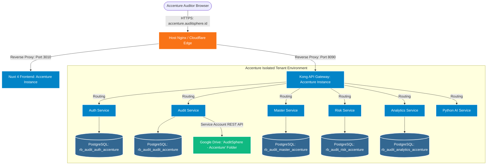

# AuditSphere Client Tenant & Domain Provisioning Guide
## How to Onboard a New Client Domain, Database Instance & Google Drive Storage

This documentation provides an end-to-end guide on provisioning a new client tenant for **AuditSphere (Risk-Based Internal Audit - RBIA)**. 

To illustrate every step concretely, this guide uses **Client A: Accenture** with the target domain **`accenture.auditsphere.id`**.

---

## 📑 Table of Contents
1. [Architecture & Multi-Tenancy Model](#1-architecture--multi-tenancy-model)
2. [Tenant Planning & Provisioning Parameters](#2-tenant-planning--provisioning-parameters)
3. [Phase 1: Domain, DNS & SSL/TLS Configuration](#phase-1-domain-dns--ssltls-configuration)
4. [Phase 2: Database Provisioning & Schema Migrations](#phase-2-database-provisioning--schema-migrations)
5. [Phase 3: Google Drive Cloud Storage Provisioning](#phase-3-google-drive-cloud-storage-provisioning)
6. [Phase 4: Backend Microservices & Kong Gateway Setup](#phase-4-backend-microservices--kong-gateway-setup)
7. [Phase 5: Frontend (Nuxt 4) Deployment & Branding](#phase-5-frontend-nuxt-4-deployment--branding)
8. [Phase 6: Automated Tenant Onboarding Script](#phase-6-automated-tenant-onboarding-script)
9. [Phase 7: Verification & Smoke Testing Checklist](#phase-7-verification--smoke-testing-checklist)
10. [Phase 8: Maintenance, Backup & Data Compliance (UU PDP / GDPR)](#phase-8-maintenance-backup--data-compliance-uu-pdp--gdpr)

---

## 1. Architecture & Multi-Tenancy Model

AuditSphere manages sensitive corporate internal audit information: audit charters, risk appetite statements, fraud investigation fieldwork, working papers, and executive findings. Because of strict regulatory frameworks (**ISO 27001**, **GDPR**, and Indonesia's **Undang-Undang Perlindungan Data Pribadi / UU PDP**), client data isolation is critical.

### The Silo Isolation Architecture (Recommended)

AuditSphere uses a **Containerized Silo Multi-Tenant Architecture** (or isolated database instance per tenant), mirroring the successful dev/prod separation already established in the infrastructure:



### Key Isolation Benefits
- **Zero Cross-Tenant Leakage**: Dedicated databases ensure that no query can accidentally return another client's audit findings.
- **Dedicated Cloud Storage**: Audit fieldwork files, interview evidence, and observation attachments are segregated in an isolated Google Drive root directory.
- **Custom Retention & Encryption**: Allows custom encryption keys and backup intervals per client.

---

## 2. Tenant Planning & Provisioning Parameters

Before provisioning a new client, define their tenant parameters:

| Parameter | Example Value (Accenture) | Description |
| :--- | :--- | :--- |
| **Client Name** | `Accenture` | Official organization name displayed in UI |
| **Tenant Slug / Code** | `accenture` | Lowercase alphanumeric identifier used for URLs, DBs, and folders |
| **Frontend Domain** | `accenture.auditsphere.id` | Client URL accessible by corporate auditors |
| **API Domain** | `api-accenture.auditsphere.id` | API Gateway endpoint |
| **Server IP (VPS)** | `202.10.34.166` | Hosting IP address |
| **Assigned Frontend Port** | `3010` | Internal container port for tenant Nuxt frontend |
| **Assigned Kong Gateway Port**| `8090` (Proxy), `8019` (Admin)| Internal container ports for tenant Kong gateway |
| **Database Prefix** | `rb_audit_*_accenture` | Isolated database names |
| **Google Drive Root Folder**| `AuditSphere - Accenture` | Dedicated folder on Google Drive |
| **Client Admin Email** | `admin@accenture.com` | Initial administrator account |

---

## Phase 1: Domain, DNS & SSL/TLS Configuration

### 1. Configure DNS Records
Add DNS `A` or `CNAME` records at your DNS Registrar (e.g., Cloudflare, Route 53, or Niagahoster):

```dns
# Type    Name                  Target          TTL
A         accenture             202.10.34.166   300 (Auto)
A         api-accenture         202.10.34.166   300 (Auto)
```

> [!TIP]
> If you have a wildcard DNS record `*.auditsphere.id -> 202.10.34.166`, `accenture.auditsphere.id` and `api-accenture.auditsphere.id` will resolve automatically without manual DNS intervention!

### 2. Configure SSL/TLS Certificate (Let's Encrypt / Certbot)
On the hosting server, issue SSL certificates using Certbot:

```bash
# Obtain certificate for both frontend and backend subdomains
sudo certbot certonly --nginx \
  -d accenture.auditsphere.id \
  -d api-accenture.auditsphere.id \
  --agree-tos \
  --email admin@auditsphere.id \
  --non-interactive
```

### 3. Setup Host Reverse Proxy (Nginx)
Create `/etc/nginx/sites-available/accenture.auditsphere.id.conf`:

```nginx
# ─────────────────────────────────────────────────────────────
# AuditSphere Frontend - accenture.auditsphere.id
# ─────────────────────────────────────────────────────────────
server {
    listen 80;
    server_name accenture.auditsphere.id;
    return 301 https://$host$request_uri;
}

server {
    listen 443 ssl http2;
    server_name accenture.auditsphere.id;

    ssl_certificate /etc/letsencrypt/live/accenture.auditsphere.id/fullchain.pem;
    ssl_certificate_key /etc/letsencrypt/live/accenture.auditsphere.id/privkey.pem;
    include /etc/letsencrypt/options-ssl-nginx.conf;
    ssl_dhparam /etc/letsencrypt/ssl-dhparams.pem;

    client_max_body_size 100M;

    location / {
        proxy_pass http://127.0.0.1:3010; # Accenture Frontend Container
        proxy_http_version 1.1;
        proxy_set_header Upgrade $http_upgrade;
        proxy_set_header Connection 'upgrade';
        proxy_set_header Host $host;
        proxy_cache_bypass $http_upgrade;
        proxy_set_header X-Real-IP $remote_addr;
        proxy_set_header X-Forwarded-For $proxy_add_x_forwarded_for;
        proxy_set_header X-Forwarded-Proto $scheme;
    }
}

# ─────────────────────────────────────────────────────────────
# AuditSphere API Gateway - api-accenture.auditsphere.id
# ─────────────────────────────────────────────────────────────
server {
    listen 80;
    server_name api-accenture.auditsphere.id;
    return 301 https://$host$request_uri;
}

server {
    listen 443 ssl http2;
    server_name api-accenture.auditsphere.id;

    ssl_certificate /etc/letsencrypt/live/accenture.auditsphere.id/fullchain.pem;
    ssl_certificate_key /etc/letsencrypt/live/accenture.auditsphere.id/privkey.pem;
    include /etc/letsencrypt/options-ssl-nginx.conf;
    ssl_dhparam /etc/letsencrypt/ssl-dhparams.pem;

    client_max_body_size 100M;

    location / {
        proxy_pass http://127.0.0.1:8090; # Accenture Kong Gateway Proxy
        proxy_http_version 1.1;
        proxy_set_header Host $host;
        proxy_set_header X-Real-IP $remote_addr;
        proxy_set_header X-Forwarded-For $proxy_add_x_forwarded_for;
        proxy_set_header X-Forwarded-Proto $scheme;
    }
}
```

Enable the configuration and reload Nginx:
```bash
sudo ln -s /etc/nginx/sites-available/accenture.auditsphere.id.conf /etc/nginx/sites-enabled/
sudo nginx -t && sudo systemctl reload nginx
```

---

## Phase 2: Database Provisioning & Schema Migrations

Each microservice in AuditSphere connects to its own database. For Accenture, we create isolated databases with the prefix `rb_audit_*_accenture`.

### 1. Create Tenant Databases in PostgreSQL
Connect to the PostgreSQL instance (or execute inside `rb_audit_postgres` container):

```bash
docker exec -i rb_audit_postgres psql -U postgres <<EOF
-- Create isolated databases for Accenture
CREATE DATABASE rb_audit_auth_accenture;
CREATE DATABASE rb_audit_audit_accenture;
CREATE DATABASE rb_audit_master_accenture;
CREATE DATABASE rb_audit_risk_accenture;
CREATE DATABASE rb_audit_analytics_accenture;

-- (Optional) Create dedicated user with isolated privileges
CREATE USER db_user_accenture WITH ENCRYPTED PASSWORD 'AccentureSecurePassword2026!';
GRANT ALL PRIVILEGES ON DATABASE rb_audit_auth_accenture TO db_user_accenture;
GRANT ALL PRIVILEGES ON DATABASE rb_audit_audit_accenture TO db_user_accenture;
GRANT ALL PRIVILEGES ON DATABASE rb_audit_master_accenture TO db_user_accenture;
GRANT ALL PRIVILEGES ON DATABASE rb_audit_risk_accenture TO db_user_accenture;
GRANT ALL PRIVILEGES ON DATABASE rb_audit_analytics_accenture TO db_user_accenture;
EOF
```

### 2. Run Database Migrations & Initial Seeders
Run migrations for each Go microservice pointing to the new databases:

```bash
# 1. Auth Service Migrations & Default RBAC Seeding
(cd backend/auth-service && \
  DB_NAME=rb_audit_auth_accenture ./auth --config ./pkg/config/config.yaml migrate up && \
  DB_NAME=rb_audit_auth_accenture ./auth --config ./pkg/config/config.yaml seed)

# 2. Audit Service Migrations
(cd backend/audit-service && \
  DB_NAME=rb_audit_audit_accenture ./audit --config ./pkg/config/config.yaml migrate up)

# 3. Master Service Migrations & Organization Seeder
(cd backend/master-service && \
  DB_NAME=rb_audit_master_accenture ./master --config ./pkg/config/config.yaml migrate up)

# 4. Risk Service Migrations & Seed Risk Universe
(cd backend/risk-service && \
  DB_NAME=rb_audit_risk_accenture ./risk --config ./pkg/config/config.yaml migrate up && \
  DB_NAME=rb_audit_risk_accenture ./risk --config ./pkg/config/config.yaml seed)

# 5. Analytics Service Migrations
(cd backend/analytics-service && \
  DB_NAME=rb_audit_analytics_accenture ./analytics --config ./pkg/config/config.yaml migrate up)
```

> [!NOTE]
> The auth seeder automatically initializes standard roles: `Super Admin`, `Chief Audit Executive (CAE)`, `Audit Team Leader`, `Auditor`, and `Auditee`, ready for the Accenture internal audit team.

---

## Phase 3: Google Drive Cloud Storage Provisioning

AuditSphere uses Google Drive via raw REST API calls (`backend/audit-service/pkg/media/gdrive.go`) using a Google Cloud Service Account. File uploads (interview recordings, working paper attachments, evidence documents) are organized in a hierarchy under a client root folder.

### 1. Prepare Google Cloud Service Account
1. Open [Google Cloud Console](https://console.cloud.google.com/).
2. Enable **Google Drive API**.
3. Under **IAM & Admin > Service Accounts**, create a service account: `auditsphere-storage@<project-id>.iam.gserviceaccount.com`.
4. Create and download a JSON key. Place it securely at:
   `backend/audit-service/pkg/config/gdrive-credentials.json`.

### 2. Create the Client Root Folder in Google Drive
1. Log in to Google Drive with your organization administrator account.
2. Create a folder named: **`AuditSphere - Accenture`**.
3. Open the folder and copy the **Folder ID** from the browser address bar:
   ```
   https://drive.google.com/drive/folders/1bX7yZ9kL0mN8pQ2rS4tU6vW8xYz1234A
                                          └──────────────────────────────┘
                                                 default_folder_id
   ```
4. Click **Share** on the folder and add your Service Account email:
   `auditsphere-storage@<project-id>.iam.gserviceaccount.com`
   with role **Editor** (so it can create subdirectories and write files).

### 3. Pre-create Tenant Folder Structure
AuditSphere automatically organizes documents into nested subfolders. You can optionally pre-create or let `gdrive.go` auto-generate them:
- `AuditSphere - Accenture/`
  - `audit_charter/`
  - `fieldwork/`
  - `observations/`
  - `interviews/`
  - `working_papers/`
  - `evidence_documents/`
  - `reports/`

### 4. Configure `audit-service` Configuration
Update or override `backend/audit-service/pkg/config/config.yaml` for Accenture:

```yaml
gdrive:
  enabled: true
  auth_mode: "service_account"
  credentials_json_path: "./pkg/config/gdrive-credentials.json"
  default_folder_id: "1bX7yZ9kL0mN8pQ2rS4tU6vW8xYz1234A" # Accenture Root Folder ID
```

> [!TIP]
> If Google Drive quota is exceeded or internet is unavailable, `backend/audit-service/pkg/media/gdrive.go` has an automatic fallback to local disk storage (`uploads/AuditSphere - Accenture/...`), guaranteeing zero downtime for auditors.

---

## Phase 4: Backend Microservices & Kong Gateway Setup

### 1. Update Kong Gateway Declarative Configuration (`kong.yml`)
Add the new client domain to the CORS allowed origins in `backend/kong-gateway/kong/prod/kong.yml`:

```yaml
plugins:
  - name: cors
    config:
      origins:
        - "https://auditsphere.app"
        - "https://accenture.auditsphere.id" # <-- Add new client domain
      methods:
        - GET
        - POST
        - PUT
        - PATCH
        - DELETE
        - OPTIONS
      headers:
        - Accept
        - Authorization
        - Cache-Control
        - Content-Type
        - Origin
        - X-Requested-With
        - X-CSRF-Token
      credentials: true
      max_age: 3600
```

Reload Kong declarative configuration:
```bash
curl -i -X POST http://localhost:8009/config \
  -F config=@/usr/local/kong/declarative/kong.yml
```

### 2. Tenant Docker Compose Configuration (`docker-compose.accenture.yml`)
For isolated microservice instances, create `backend/docker-compose.accenture.yml`:

```yaml
name: rbia_accenture

services:
  accenture-auth:
    image: rb-audit-auth:latest
    container_name: rbia_auth_accenture
    environment:
      - DATABASE_NAME=rb_audit_auth_accenture
      - PORT=8011
    networks:
      - rb_audit_network
    restart: unless-stopped

  accenture-audit:
    image: rb-audit-audit:latest
    container_name: rbia_audit_accenture
    environment:
      - DATABASE_NAME=rb_audit_audit_accenture
      - GDRIVE_ENABLED=true
      - GDRIVE_DEFAULT_FOLDER_ID=1bX7yZ9kL0mN8pQ2rS4tU6vW8xYz1234A
      - PORT=8012
    networks:
      - rb_audit_network
    restart: unless-stopped

  accenture-master:
    image: rb-audit-master:latest
    container_name: rbia_master_accenture
    environment:
      - DATABASE_NAME=rb_audit_master_accenture
      - PORT=8013
    networks:
      - rb_audit_network
    restart: unless-stopped

  accenture-risk:
    image: rb-audit-risk:latest
    container_name: rbia_risk_accenture
    environment:
      - DATABASE_NAME=rb_audit_risk_accenture
      - PORT=8014
    networks:
      - rb_audit_network
    restart: unless-stopped

  accenture-kong:
    image: kong:3.4
    container_name: rbia_kong_accenture
    volumes:
      - ./kong-gateway/kong/accenture:/usr/local/kong/declarative
    environment:
      KONG_DATABASE: "off"
      KONG_DECLARATIVE_CONFIG: /usr/local/kong/declarative/kong.yml
      KONG_PROXY_LISTEN: 0.0.0.0:8090
      KONG_ADMIN_LISTEN: 0.0.0.0:8019
    ports:
      - "8090:8090"
      - "8019:8019"
    networks:
      - rb_audit_network
    restart: unless-stopped

networks:
  rb_audit_network:
    external: true
```

---

## Phase 5: Frontend (Nuxt 4) Deployment & Branding

### 1. Deploy Tenant Frontend Container
Deploy a dedicated Nuxt container listening on port `3010`:

```bash
mkdir -p /app/rbia-frontend-accenture
cd /app/rbia-frontend-accenture
```

Create `/app/rbia-frontend-accenture/.env`:
```env
API_BASE_URL=https://api-accenture.auditsphere.id/api/v1
ANALYTICS_API_BASE_URL=https://api-accenture.auditsphere.id/api/analytics
NUXT_PUBLIC_AUTH_SERVICE_BASE_URL=https://api-accenture.auditsphere.id/api/v1
NUXT_PUBLIC_AUDIT_SERVICE_BASE_URL=https://api-accenture.auditsphere.id/api/v1
NUXT_PUBLIC_RISK_SERVICE_BASE_URL=https://api-accenture.auditsphere.id/api/v1
NUXT_PUBLIC_MASTER_SERVICE_BASE_URL=https://api-accenture.auditsphere.id/api/v1
NUXT_PUBLIC_TENANT_NAME="Accenture"
NUXT_PUBLIC_TENANT_LOGO="/branding/accenture-logo.png"
```

Create `/app/rbia-frontend-accenture/docker-compose.yml`:
```yaml
version: '3.8'

services:
  frontend-accenture:
    image: rbia-frontend-prod:latest
    container_name: rbia_frontend_accenture
    ports:
      - "3010:3000"
    env_file:
      - .env
    restart: unless-stopped
```

Start the container:
```bash
docker compose up -d
```

### 2. Client Branding & Customization
To customize the logo and brand for Accenture in `frontend/components/Logo.vue`:
- Place `accenture-logo.png` in `frontend/public/branding/accenture-logo.png`.
- The logo dynamically checks `useRuntimeConfig().public.tenantName` or defaults to AuditSphere.

---

## Phase 6: Automated Tenant Onboarding Script

To onboard new clients in under 2 minutes, use the following bash automation script:

`scripts/onboard-tenant.sh`:
```bash
#!/bin/bash
# =============================================================================
# AuditSphere Automated Tenant Onboarding Script
# Usage: ./scripts/onboard-tenant.sh <tenant_slug> <client_name> <gdrive_folder_id> <frontend_port> <kong_port>
# Example: ./scripts/onboard-tenant.sh accenture "Accenture" "1bX7yZ9kL0mN8pQ2rS4tU6vW8xYz1234A" 3010 8090
# =============================================================================

set -e

SLUG=${1:?"Error: Tenant slug is required (e.g. accenture)"}
CLIENT_NAME=${2:?"Error: Client name is required (e.g. 'Accenture')"}
GDRIVE_ID=${3:?"Error: Google Drive Folder ID is required"}
FE_PORT=${4:-3010}
KONG_PORT=${5:-8090}

DOMAIN="${SLUG}.auditsphere.id"
API_DOMAIN="api-${SLUG}.auditsphere.id"

echo "╔══════════════════════════════════════════════════════════════╗"
echo "║          AuditSphere Client Onboarding: $CLIENT_NAME         "
echo "║          Domain    : $DOMAIN                                 "
echo "║          API Domain: $API_DOMAIN                             "
echo "║          GDrive ID : $GDRIVE_ID                              "
echo "╚══════════════════════════════════════════════════════════════╝"

# 1. Create Databases
echo "==> [1/5] Creating isolated PostgreSQL databases..."
docker exec -i rb_audit_postgres psql -U postgres <<EOSQL
CREATE DATABASE rb_audit_auth_${SLUG};
CREATE DATABASE rb_audit_audit_${SLUG};
CREATE DATABASE rb_audit_master_${SLUG};
CREATE DATABASE rb_audit_risk_${SLUG};
CREATE DATABASE rb_audit_analytics_${SLUG};
EOSQL

# 2. Run Migrations & Seeds
echo "==> [2/5] Running schema migrations & initial seeds..."
(cd backend/auth-service && DB_NAME=rb_audit_auth_${SLUG} ./auth migrate up && DB_NAME=rb_audit_auth_${SLUG} ./auth seed)
(cd backend/audit-service && DB_NAME=rb_audit_audit_${SLUG} ./audit migrate up)
(cd backend/master-service && DB_NAME=rb_audit_master_${SLUG} ./master migrate up)
(cd backend/risk-service && DB_NAME=rb_audit_risk_${SLUG} ./risk migrate up && DB_NAME=rb_audit_risk_${SLUG} ./risk seed)
(cd backend/analytics-service && DB_NAME=rb_audit_analytics_${SLUG} ./analytics migrate up)

# 3. Generate Nginx Config
echo "==> [3/5] Generating Nginx reverse proxy configuration..."
cat <<NGINXCONF > /etc/nginx/sites-available/${DOMAIN}.conf
server {
    listen 80;
    server_name ${DOMAIN};
    location / {
        proxy_pass http://127.0.0.1:${FE_PORT};
        proxy_set_header Host \$host;
        proxy_set_header X-Real-IP \$remote_addr;
    }
}
server {
    listen 80;
    server_name ${API_DOMAIN};
    location / {
        proxy_pass http://127.0.0.1:${KONG_PORT};
        proxy_set_header Host \$host;
        proxy_set_header X-Real-IP \$remote_addr;
    }
}
NGINXCONF

ln -sf /etc/nginx/sites-available/${DOMAIN}.conf /etc/nginx/sites-enabled/
nginx -t && systemctl reload nginx

# 4. Issue SSL Certificates
echo "==> [4/5] Provisioning SSL certificates via Certbot..."
certbot --nginx -d ${DOMAIN} -d ${API_DOMAIN} --agree-tos -m admin@auditsphere.id --non-interactive || echo "Warning: Certbot skipped or DNS not yet propagated"

# 5. Launch Tenant Stack
echo "==> [5/5] Tenant stack successfully initialized!"
echo "--------------------------------------------------------------"
echo "Client $CLIENT_NAME is ready at: https://${DOMAIN}"
echo "API Endpoint at: https://${API_DOMAIN}"
echo "--------------------------------------------------------------"
```

Make the script executable:
```bash
chmod +x scripts/onboard-tenant.sh
```

---

## Phase 7: Verification & Smoke Testing Checklist

After provisioning, complete this verification checklist before handing off credentials to the client:

| Step | Verification Test | Expected Result | Pass/Fail |
| :--- | :--- | :--- | :---: |
| **1. DNS Resolution** | `nslookup accenture.auditsphere.id` | Resolves to VPS IP (`202.10.34.166`) | [ ] |
| **2. HTTPS Security** | `curl -Iv https://accenture.auditsphere.id` | HTTP 200/301, Valid SSL Certificate | [ ] |
| **3. API Health Check** | `curl https://api-accenture.auditsphere.id/api/v1/auth/health` | `{"status":"ok"}` | [ ] |
| **4. Database Isolation** | Run test query on `rb_audit_audit_accenture` | Table `audit_engagements` exists and is empty | [ ] |
| **5. Google Drive Upload** | Upload sample interview audio/PDF in Audit Fieldwork | File appears in Google Drive folder `AuditSphere - Accenture` | [ ] |
| **6. Local Disk Fallback**| Disable internet/revoke Drive token temporarily | File saves to `/uploads/AuditSphere - Accenture/` without error | [ ] |
| **7. User Authentication**| Log in as Tenant Admin at `https://accenture.auditsphere.id` | JWT issued with tenant claim, dashboard loads < 2s | [ ] |

---

## Phase 8: Maintenance, Backup & Data Compliance (UU PDP / GDPR)

### 1. Isolated Daily Tenant Database Backups
To comply with audit retention and SLA policies, back up the client's databases daily:

```bash
#!/bin/bash
# Backup script: /opt/scripts/backup-tenant.sh
TENANT="accenture"
TIMESTAMP=$(date +"%Y%m%d_%H%M%S")
BACKUP_DIR="/backups/tenants/${TENANT}/${TIMESTAMP}"
mkdir -p "$BACKUP_DIR"

for DB in auth audit master risk analytics; do
  docker exec rb_audit_postgres pg_dump -U postgres rb_audit_${DB}_${TENANT} | gzip > "${BACKUP_DIR}/${DB}.sql.gz"
done

# Encrypt backup using GPG
gpg --batch --yes --passphrase-file /etc/backup-key.txt -c "${BACKUP_DIR}"/*.sql.gz
```

Add to crontab:
```cron
0 2 * * * /opt/scripts/backup-tenant.sh accenture
```

### 2. Client Offboarding & Right to be Forgotten (UU PDP Compliance)
If the client contract terminates, UU PDP mandates secure data erasure:
1. **Archive & Export**: Export all database dumps and Google Drive files into an encrypted bundle and deliver to the client.
2. **Purge Databases**:
   ```sql
   DROP DATABASE rb_audit_auth_accenture;
   DROP DATABASE rb_audit_audit_accenture;
   DROP DATABASE rb_audit_master_accenture;
   DROP DATABASE rb_audit_risk_accenture;
   DROP DATABASE rb_audit_analytics_accenture;
   ```
3. **Purge Google Drive Storage**: Move the `AuditSphere - Accenture` root folder to Google Drive Trash and empty Trash permanently.
4. **Deactivate Domain & Nginx Block**: Remove `/etc/nginx/sites-enabled/accenture.auditsphere.id.conf` and revoke Certbot certificate.

---

## 📌 Summary Reference Table

```
Client Name          : Accenture
Frontend URL         : https://accenture.auditsphere.id
API Gateway URL      : https://api-accenture.auditsphere.id
Database Cluster     : PostgreSQL 16 (Databases: rb_audit_*_accenture)
Cloud Storage        : Google Drive Root (Folder: 'AuditSphere - Accenture')
Storage Fallback     : Local FS (/uploads/AuditSphere - Accenture/...)
Target SLA           : Search < 5s, Dashboard < 2s (Multi-AZ & Redis-backed)
Compliance           : ISO 27001, GDPR, Indonesian UU PDP
```
