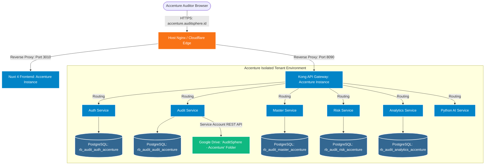

# AuditSphere Client Tenant & Domain Provisioning Guide
## How to Onboard a New Client Domain, Database Instance & Google Drive Storage

This documentation provides an end-to-end guide on provisioning a new client tenant for **AuditSphere (Risk-Based Internal Audit - RBIA)**. 

To illustrate every step concretely, this guide uses **Client A: Accenture** with the target domain **`accenture.auditsphere.id`**.

---

## 📑 Table of Contents
1. [Architecture & Multi-Tenancy Model](#1-architecture--multi-tenancy-model)
2. [Tenant Planning & Provisioning Parameters](#2-tenant-planning--provisioning-parameters)
3. [Phase 1: Domain, DNS & SSL/TLS Configuration](#phase-1-domain-dns--ssltls-configuration)
4. [Phase 2: Database Provisioning & Schema Migrations](#phase-2-database-provisioning--schema-migrations)
5. [Phase 3: Google Drive Cloud Storage Provisioning](#phase-3-google-drive-cloud-storage-provisioning)
6. [Phase 4: Backend Microservices & Kong Gateway Setup](#phase-4-backend-microservices--kong-gateway-setup)
7. [Phase 5: Frontend (Nuxt 4) Deployment & Branding](#phase-5-frontend-nuxt-4-deployment--branding)
8. [Phase 6: Automated Tenant Onboarding Script](#phase-6-automated-tenant-onboarding-script)
9. [Phase 7: Verification & Smoke Testing Checklist](#phase-7-verification--smoke-testing-checklist)
10. [Phase 8: Maintenance, Backup & Data Compliance (UU PDP / GDPR)](#phase-8-maintenance-backup--data-compliance-uu-pdp--gdpr)

---

## 1. Architecture & Multi-Tenancy Model

AuditSphere manages sensitive corporate internal audit information: audit charters, risk appetite statements, fraud investigation fieldwork, working papers, and executive findings. Because of strict regulatory frameworks (**ISO 27001**, **GDPR**, and Indonesia's **Undang-Undang Perlindungan Data Pribadi / UU PDP**), client data isolation is critical.

### The Silo Isolation Architecture (Recommended)

AuditSphere uses a **Containerized Silo Multi-Tenant Architecture** (or isolated database instance per tenant), mirroring the successful dev/prod separation already established in the infrastructure:


```mermaid
graph TD
    ClientUser([Accenture Auditor Browser]) -->|HTTPS: accenture.auditsphere.id| EdgeLB[Host Nginx / Cloudflare Edge]
    EdgeLB -->|Reverse Proxy: Port 3010| NuxtApp[Nuxt 4 Frontend: Accenture Instance]
    EdgeLB -->|Reverse Proxy: Port 8090| KongGW[Kong API Gateway: Accenture Instance]
    
    subgraph Accenture_Tenant_Stack ["Accenture Isolated Tenant Environment"]
        KongGW -->|Routing| AuthSvc[Auth Service]
        KongGW -->|Routing| AuditSvc[Audit Service]
        KongGW -->|Routing| MasterSvc[Master Service]
        KongGW -->|Routing| RiskSvc[Risk Service]
        KongGW -->|Routing| AnalyticsSvc[Analytics Service]
        KongGW -->|Routing| PyAISvc[Python AI Service]
        
        AuthSvc --> DB_Auth[(PostgreSQL: rb_audit_auth_accenture)]
        AuditSvc --> DB_Audit[(PostgreSQL: rb_audit_audit_accenture)]
        MasterSvc --> DB_Master[(PostgreSQL: rb_audit_master_accenture)]
        RiskSvc --> DB_Risk[(PostgreSQL: rb_audit_risk_accenture)]
        AnalyticsSvc --> DB_Analytics[(PostgreSQL: rb_audit_analytics_accenture)]
        
        AuditSvc -->|Service Account REST API| GDrive[Google Drive: 'AuditSphere - Accenture' Folder]
    end
    
    classDef edge fill:#f97316,stroke:#fff,stroke-width:2px,color:#fff;
    classDef tenant fill:#0284c7,stroke:#fff,stroke-width:2px,color:#fff;
    classDef db fill:#336791,stroke:#fff,stroke-width:2px,color:#fff;
    classDef storage fill:#10b981,stroke:#fff,stroke-width:2px,color:#fff;
    
    class EdgeLB edge;
    class NuxtApp,KongGW,AuthSvc,AuditSvc,MasterSvc,RiskSvc,AnalyticsSvc,PyAISvc tenant;
    class DB_Auth,DB_Audit,DB_Master,DB_Risk,DB_Analytics db;
    class GDrive storage;
```

### Key Isolation Benefits
- **Zero Cross-Tenant Leakage**: Dedicated databases ensure that no query can accidentally return another client's audit findings.
- **Dedicated Cloud Storage**: Audit fieldwork files, interview evidence, and observation attachments are segregated in an isolated Google Drive root directory.
- **Custom Retention & Encryption**: Allows custom encryption keys and backup intervals per client.

---

## 2. Tenant Planning & Provisioning Parameters

Before provisioning a new client, define their tenant parameters:

| Parameter | Example Value (Accenture) | Description |
| :--- | :--- | :--- |
| **Client Name** | `Accenture` | Official organization name displayed in UI |
| **Tenant Slug / Code** | `accenture` | Lowercase alphanumeric identifier used for URLs, DBs, and folders |
| **Frontend Domain** | `accenture.auditsphere.id` | Client URL accessible by corporate auditors |
| **API Domain** | `api-accenture.auditsphere.id` | API Gateway endpoint |
| **Server IP (VPS)** | `202.10.34.166` | Hosting IP address |
| **Assigned Frontend Port** | `3010` | Internal container port for tenant Nuxt frontend |
| **Assigned Kong Gateway Port**| `8090` (Proxy), `8019` (Admin)| Internal container ports for tenant Kong gateway |
| **Database Prefix** | `rb_audit_*_accenture` | Isolated database names |
| **Google Drive Root Folder**| `AuditSphere - Accenture` | Dedicated folder on Google Drive |
| **Client Admin Email** | `admin@accenture.com` | Initial administrator account |

---

## Phase 1: Domain, DNS & SSL/TLS Configuration

### 1. Configure DNS Records
Add DNS `A` or `CNAME` records at your DNS Registrar (e.g., Cloudflare, Route 53, or Niagahoster):

```dns
# Type    Name                  Target          TTL
A         accenture             202.10.34.166   300 (Auto)
A         api-accenture         202.10.34.166   300 (Auto)
```

> [!TIP]
> If you have a wildcard DNS record `*.auditsphere.id -> 202.10.34.166`, `accenture.auditsphere.id` and `api-accenture.auditsphere.id` will resolve automatically without manual DNS intervention!

### 2. Configure SSL/TLS Certificate (Let's Encrypt / Certbot)
On the hosting server, issue SSL certificates using Certbot:

```bash
# Obtain certificate for both frontend and backend subdomains
sudo certbot certonly --nginx \
  -d accenture.auditsphere.id \
  -d api-accenture.auditsphere.id \
  --agree-tos \
  --email admin@auditsphere.id \
  --non-interactive
```

### 3. Setup Host Reverse Proxy (Nginx)
Create `/etc/nginx/sites-available/accenture.auditsphere.id.conf`:

```nginx
# ─────────────────────────────────────────────────────────────
# AuditSphere Frontend - accenture.auditsphere.id
# ─────────────────────────────────────────────────────────────
server {
    listen 80;
    server_name accenture.auditsphere.id;
    return 301 https://$host$request_uri;
}

server {
    listen 443 ssl http2;
    server_name accenture.auditsphere.id;

    ssl_certificate /etc/letsencrypt/live/accenture.auditsphere.id/fullchain.pem;
    ssl_certificate_key /etc/letsencrypt/live/accenture.auditsphere.id/privkey.pem;
    include /etc/letsencrypt/options-ssl-nginx.conf;
    ssl_dhparam /etc/letsencrypt/ssl-dhparams.pem;

    client_max_body_size 100M;

    location / {
        proxy_pass http://127.0.0.1:3010; # Accenture Frontend Container
        proxy_http_version 1.1;
        proxy_set_header Upgrade $http_upgrade;
        proxy_set_header Connection 'upgrade';
        proxy_set_header Host $host;
        proxy_cache_bypass $http_upgrade;
        proxy_set_header X-Real-IP $remote_addr;
        proxy_set_header X-Forwarded-For $proxy_add_x_forwarded_for;
        proxy_set_header X-Forwarded-Proto $scheme;
    }
}

# ─────────────────────────────────────────────────────────────
# AuditSphere API Gateway - api-accenture.auditsphere.id
# ─────────────────────────────────────────────────────────────
server {
    listen 80;
    server_name api-accenture.auditsphere.id;
    return 301 https://$host$request_uri;
}

server {
    listen 443 ssl http2;
    server_name api-accenture.auditsphere.id;

    ssl_certificate /etc/letsencrypt/live/accenture.auditsphere.id/fullchain.pem;
    ssl_certificate_key /etc/letsencrypt/live/accenture.auditsphere.id/privkey.pem;
    include /etc/letsencrypt/options-ssl-nginx.conf;
    ssl_dhparam /etc/letsencrypt/ssl-dhparams.pem;

    client_max_body_size 100M;

    location / {
        proxy_pass http://127.0.0.1:8090; # Accenture Kong Gateway Proxy
        proxy_http_version 1.1;
        proxy_set_header Host $host;
        proxy_set_header X-Real-IP $remote_addr;
        proxy_set_header X-Forwarded-For $proxy_add_x_forwarded_for;
        proxy_set_header X-Forwarded-Proto $scheme;
    }
}
```

Enable the configuration and reload Nginx:
```bash
sudo ln -s /etc/nginx/sites-available/accenture.auditsphere.id.conf /etc/nginx/sites-enabled/
sudo nginx -t && sudo systemctl reload nginx
```

---

## Phase 2: Database Provisioning & Schema Migrations

Each microservice in AuditSphere connects to its own database. For Accenture, we create isolated databases with the prefix `rb_audit_*_accenture`.

### 1. Create Tenant Databases in PostgreSQL

`scripts/onboard-tenant.sh` does this for you (step 2), skipping any database
that already exists so re-onboarding a tenant is safe. To do it by hand:

```bash
docker exec -i rb_audit_postgres psql -U postgres <<EOSQL
CREATE DATABASE rb_audit_auth_accenture;
CREATE DATABASE rb_audit_audit_accenture;
CREATE DATABASE rb_audit_master_accenture;
CREATE DATABASE rb_audit_risk_accenture;
EOSQL
```

There is no `rb_audit_analytics_accenture`. `analytics-service` is stateless —
`cmd/main.go` starts a gin server and opens no database handle — so an analytics
database would be created and never connected to.

> [!NOTE]
> The services authenticate as the `postgres` superuser from their config, so a
> per-tenant database user is not wired up today. Adding one means overriding
> `DATABASE_USERNAME` / `DATABASE_PASSWORD` in the tenant's generated compose
> file as well as creating the role — granting privileges alone changes nothing.

### 2. Run Database Migrations & Initial Seeders

Run these **inside the tenant's containers**, not on the host:

```bash
TENANT=backend/tenants/accenture
COMPOSE="docker compose --project-directory $TENANT --env-file $TENANT/.env"

$COMPOSE run --rm --no-deps auth-service-accenture   ./auth migrate up
$COMPOSE run --rm --no-deps auth-service-accenture   ./auth seed      # roles & permissions
$COMPOSE run --rm --no-deps audit-service-accenture  ./audit migrate up
$COMPOSE run --rm --no-deps master-service-accenture ./master migrate
$COMPOSE run --rm --no-deps risk-service-accenture   ./risk up

# Demo dataset only — skip these for a clean, empty tenant
$COMPOSE run --rm --no-deps audit-service-accenture  ./audit seed
$COMPOSE run --rm --no-deps master-service-accenture ./master seed
$COMPOSE run --rm --no-deps risk-service-accenture   ./risk seed
```

> [!WARNING]
> **Do not run the migration binaries from the host.** The services resolve
> Postgres at the hostname `postgres`, a Docker network alias that does not
> resolve outside the bridge, and `backend/docker-compose.yml` publishes no
> Postgres port — so a host-run migration cannot reach the database at all.

> [!WARNING]
> **The env var is `DATABASE_NAME`, not `DB_NAME`.** The config key is
> `database.name`, which viper's env-key replacer maps to `DATABASE_NAME`.
> `DB_NAME` is bound to nothing: setting it is silently ignored and the service
> falls back to the shared database in `config.yaml` — migrating and seeding the
> wrong tenant. Running through the tenant's compose file avoids the trap
> entirely, since `DATABASE_NAME` is already set there per service.

The migrate verbs are **not** interchangeable between services — see the table
in [Phase 6](#phase-6-automated-tenant-onboarding-script). In particular
`./risk migrate up` fails, and `./analytics migrate up` boots a web server that
never exits.

> [!NOTE]
> The auth seeder automatically initializes standard roles: `Super Admin`, `Chief Audit Executive (CAE)`, `Audit Team Leader`, `Auditor`, and `Auditee`, ready for the Accenture internal audit team. It also creates the default `admin` / `password123` account — rotate it before handover.

---

## Phase 3: Google Drive Cloud Storage Provisioning

AuditSphere uses Google Drive via raw REST API calls (`backend/audit-service/pkg/media/gdrive.go`) using a Google Cloud Service Account. File uploads (interview recordings, working paper attachments, evidence documents) are organized in a hierarchy under a client root folder.

### 1. Prepare Google Cloud Service Account
1. Open [Google Cloud Console](https://console.cloud.google.com/).
2. Enable **Google Drive API**.
3. Under **IAM & Admin > Service Accounts**, create a service account: `auditsphere-storage@<project-id>.iam.gserviceaccount.com`.
4. Create and download a JSON key. Place it securely at:
   `backend/audit-service/pkg/config/gdrive-credentials.json`.

### 2. Create the Client Root Folder in Google Drive
1. Log in to Google Drive with your organization administrator account.
2. Create a folder named: **`AuditSphere - Accenture`**.
3. Open the folder and copy the **Folder ID** from the browser address bar:
   ```
   https://drive.google.com/drive/folders/1bX7yZ9kL0mN8pQ2rS4tU6vW8xYz1234A
                                          └──────────────────────────────┘
                                                 default_folder_id
   ```
4. Click **Share** on the folder and add your Service Account email:
   `auditsphere-storage@<project-id>.iam.gserviceaccount.com`
   with role **Editor** (so it can create subdirectories and write files).

### 3. Pre-create Tenant Folder Structure
AuditSphere automatically organizes documents into nested subfolders. You can optionally pre-create or let `gdrive.go` auto-generate them:
- `AuditSphere - Accenture/`
  - `audit_charter/`
  - `fieldwork/`
  - `observations/`
  - `interviews/`
  - `working_papers/`
  - `evidence_documents/`
  - `reports/`

### 4. Configure `audit-service` Configuration
Update or override `backend/audit-service/pkg/config/config.yaml` for Accenture:

```yaml
gdrive:
  enabled: true
  auth_mode: "service_account"
  credentials_json_path: "./pkg/config/gdrive-credentials.json"
  default_folder_id: "1bX7yZ9kL0mN8pQ2rS4tU6vW8xYz1234A" # Accenture Root Folder ID
```

> [!TIP]
> If Google Drive quota is exceeded or internet is unavailable, `backend/audit-service/pkg/media/gdrive.go` has an automatic fallback to local disk storage (`uploads/AuditSphere - Accenture/...`), guaranteeing zero downtime for auditors.

---

## Phase 4: Backend Microservices & Kong Gateway Setup

### 1. Tenant Kong Gateway Configuration

Each tenant runs **its own Kong container** with its own declarative config at
`backend/tenants/<slug>/kong/kong.yml`, rendered by the generator from
`scripts/templates/kong-tenant.yml.tpl`. Do not add client domains to the shared
`backend/kong-gateway/kong/prod/kong.yml` — that gateway belongs to the control
plane (`auditsphere.app`) and routes to the shared services.

Two things in the tenant config are worth knowing about:

**Every upstream is tenant-scoped.** Routes point at `auth-service-<slug>`,
`audit-service-<slug>` and so on, so the gateway has no route that could reach
another tenant's services even though all containers share one bridge network.

**`/api/v1/resend` is deliberately absent.** Minting Resend sending domains is a
control-plane privilege; a tenant gateway exposing it would let one client
provision email for any domain. The tenant's `auth-service` also runs with an
empty `RESEND_MASTER_API_KEY` as a second lock.

CORS is set to the tenant's own origin only. It is not on the hot path — the
frontend calls `/api/v1` same-origin and the Nuxt server proxies to the gateway —
but it matters for clients hitting `api-<slug>.auditsphere.id` directly. Never
widen it to `"*"`: with `credentials: true` a wildcard origin is both invalid
and a cross-tenant leak.

Validate a generated config before starting the stack:
```bash
docker run --rm -e KONG_DATABASE=off \
  -v "$PWD/backend/tenants/accenture/kong:/cfg:ro" \
  kong:3.4 kong config parse /cfg/kong.yml
```

### 2. Tenant Docker Compose Configuration

Do not hand-write this file. `scripts/generate-tenant-stack.sh` renders it from
`scripts/templates/docker-compose.tenant.yml.tpl` into
`backend/tenants/<slug>/docker-compose.yml`, along with the tenant's Kong config:

```bash
./scripts/generate-tenant-stack.sh accenture "Accenture"
```

The generator does the bookkeeping that is easy to get wrong by hand:

| Concern | How the generator handles it |
| :--- | :--- |
| **Host ports** | Allocated from `backend/tenants/registry.tsv`, starting at 3010 / 8090 / 8019 and skipping any port another tenant already holds. |
| **Service naming** | Every service is suffixed with the slug (`auth-service-accenture`). All tenants share the `rb_audit_network` bridge, so two tenants both claiming the alias `auth-service` would make cross-tenant routing a DNS coin flip. |
| **Database routing** | `DATABASE_NAME` per service, set in the compose file. The config key is `database.name`, which viper's env-key replacer maps to `DATABASE_NAME` — `DB_NAME` is bound to nothing and silently falls back to the shared database. |
| **Token isolation** | A fresh `JWT_SECRET` and `APP_SIGNATURE_KEY` per tenant, written to `backend/tenants/<slug>/.env` (mode 600, gitignored). The stock `config.yaml` ships one hardcoded `jwt.secret` for every service in the repo — left in place, a token minted for one tenant validates on every other tenant. |
| **Redis isolation** | A dedicated logical DB index per tenant. Sessions, MFA challenges and rate-limit counters are unprefixed keys; on a shared index they collide. Redis defaults to 16 databases, so index 0 (control plane) plus 15 tenants is the ceiling. |
| **Storage** | The tenant's evidence silo is bind-mounted into `audit-service` at `/root/uploads`, and `GDRIVE_ENABLED=false` keeps fieldwork out of the shared Drive service account. |
| **Port exposure** | Kong and the frontend publish on `127.0.0.1` only, so the host Nginx vhost is the sole way in and the TLS certificate cannot be bypassed. |

Regenerating an existing tenant requires `--force`, and reuses its ports, Redis
index and secrets — rotating `JWT_SECRET` would sign out every active auditor.

> [!WARNING]
> Both Dockerfiles copy pre-built artefacts rather than compiling: the Go
> services need their `linux/amd64` binaries present, and the frontend needs
> `frontend/.output`. A build succeeds with a stale or missing artefact and only
> fails at container start, so the generator's preflight checks for both.

---

## Phase 5: Frontend (Nuxt 4) Deployment & Branding

### 1. Tenant Frontend Container

The tenant's Nuxt container is part of the generated stack — there is no
separate `/app/rbia-frontend-<slug>` directory to create. It runs the same
`frontend/Dockerfile` image as every other tenant; only its environment differs.

The generated service points the browser and the server at different places, on
purpose:

```yaml
# Browser-facing: same-origin, so no preflight and no third-party cookies.
API_BASE_URL: /api/v1
ANALYTICS_API_BASE_URL: /api/analytics

# Server-side: Nuxt proxies those paths to this tenant's own gateway.
API_BASE_URL_SERVER: http://kong-accenture:8080/api/v1/**
ANALYTICS_API_BASE_URL_SERVER: http://kong-accenture:8080/api/analytics/**
```

Pointing the browser at `https://api-accenture.auditsphere.id` directly also
works — the Nginx vhost and the tenant Kong CORS origin are both provisioned for
it — but the same-origin default avoids CORS on the request path entirely.

The container publishes on `127.0.0.1:<fe_port>`; the host Nginx vhost from
Phase 1 is what makes it reachable at the client's domain.


### 2. Client Branding & Customization
To customize the logo and brand for Accenture in `frontend/components/Logo.vue`:
- Place `accenture-logo.png` in `frontend/public/branding/accenture-logo.png`.
- The logo dynamically checks `useRuntimeConfig().public.tenantName` or defaults to AuditSphere.

---

## Phase 6: Automated Tenant Onboarding Script

`scripts/onboard-tenant.sh` runs the whole pipeline. It calls the stack
generator from Phase 4 first, so the ports and secrets exist before anything
needs them.

```bash
chmod +x scripts/onboard-tenant.sh scripts/generate-tenant-stack.sh

# Production
./scripts/onboard-tenant.sh accenture "Accenture" 3010 8090

# Local development — <slug>.localhost, plain HTTP, no Nginx or Certbot
./scripts/onboard-tenant.sh accenture "Accenture" 3010 8090 --local --empty-data
```

| Flag | Effect |
| :--- | :--- |
| `--local` | Target `<slug>.localhost` over HTTP; skip the Nginx vhost and Certbot |
| `--empty-data` | Migrate only — no demo records (**default**) |
| `--with-demo-data` | Also run the demo seeders for audit, master and risk |
| `--skip-start` | Provision everything but leave the stack stopped |

The port arguments are requests, not guarantees: if another tenant already holds
a port, the generator takes the next free one and the script reports what was
actually allocated. `backend/tenants/registry.tsv` is the source of truth.

### What each step does

| Step | Action |
| :--- | :--- |
| 1 | Generate the tenant's compose stack and Kong config; allocate ports, Redis index, secrets |
| 2 | Create `rb_audit_{auth,audit,master,risk}_<slug>`, skipping any that already exist |
| 3 | Build the tenant service images |
| 4 | Run migrations and the role seeder **inside the containers** |
| 5 | Create the dedicated evidence storage silo |
| 6 | Start the stack (5 services + Kong + frontend) |
| 7 | Write the Nginx vhost and issue certificates (production only) |

There is no `rb_audit_analytics_<slug>` database. `analytics-service` is
stateless — `cmd/main.go` starts a gin server and opens no database handle; it
forwards scoring requests to the shared `python-ai` model server.

### Why migrations run inside the containers

The services resolve Postgres at the hostname `postgres`, which is a Docker
network alias. It does not resolve on the host, and `backend/docker-compose.yml`
publishes no Postgres port — so running the migration binaries from the host
cannot reach the database at all. Step 4 uses `docker compose run --rm --no-deps`
instead, which also means `DATABASE_NAME` comes from the generated compose file
and a tenant migration can no longer be aimed at the shared database.

The migrate verbs differ per service and are **not** interchangeable:

| Service | Migrate | Seed |
| :--- | :--- | :--- |
| `auth` | `./auth migrate up` | `./auth seed` |
| `audit` | `./audit migrate up` | `./audit seed` |
| `master` | `./master migrate` | `./master seed` |
| `risk` | `./risk up` | `./risk seed` |

`./risk migrate up` fails with `unknown command "migrate"`, and
`./analytics migrate up` ignores its arguments and boots the HTTP server — under
`set -e` that hangs the script indefinitely rather than erroring.

The auth seeder is not optional even for an empty-data tenant: it creates the
roles and permissions required to log in.

> [!WARNING]
> **Rotate the default admin before handing over the instance.** The auth seeder
> creates `admin` / `password123`, identical on every tenant.

> [!IMPORTANT]
> Back up `backend/tenants/<slug>/.env` alongside the tenant's database. It
> holds the JWT signing secret and is not in git; losing it signs out every
> auditor on that instance.

Resend sending-domain provisioning is **not** part of this script — run it from
the Site Generator, which calls `POST /api/v1/resend/provision` on the
control-plane auth-service.


---

## Phase 7: Verification & Smoke Testing Checklist

After provisioning, complete this verification checklist before handing off credentials to the client:

| Step | Verification Test | Expected Result | Pass/Fail |
| :--- | :--- | :--- | :---: |
| **1. DNS Resolution** | `nslookup accenture.auditsphere.id` | Resolves to VPS IP (`202.10.34.166`) | [ ] |
| **2. HTTPS Security** | `curl -Iv https://accenture.auditsphere.id` | HTTP 200/301, Valid SSL Certificate | [ ] |
| **3. API Health Check** | `curl https://api-accenture.auditsphere.id/api/v1/auth/health` | `{"status":"ok"}` | [ ] |
| **4. Database Isolation** | Run test query on `rb_audit_audit_accenture` | Table `audit_engagements` exists and is empty | [ ] |
| **5. Google Drive Upload** | Upload sample interview audio/PDF in Audit Fieldwork | File appears in Google Drive folder `AuditSphere - Accenture` | [ ] |
| **6. Local Disk Fallback**| Disable internet/revoke Drive token temporarily | File saves to `/uploads/AuditSphere - Accenture/` without error | [ ] |
| **7. User Authentication**| Log in as Tenant Admin at `https://accenture.auditsphere.id` | JWT issued with tenant claim, dashboard loads < 2s | [ ] |

---

## Phase 8: Maintenance, Backup & Data Compliance (UU PDP / GDPR)

### 1. Isolated Daily Tenant Database Backups
To comply with audit retention and SLA policies, back up the client's databases daily:

```bash
#!/bin/bash
# Backup script: /opt/scripts/backup-tenant.sh
TENANT="accenture"
TIMESTAMP=$(date +"%Y%m%d_%H%M%S")
BACKUP_DIR="/backups/tenants/${TENANT}/${TIMESTAMP}"
mkdir -p "$BACKUP_DIR"

for DB in auth audit master risk analytics; do
  docker exec rb_audit_postgres pg_dump -U postgres rb_audit_${DB}_${TENANT} | gzip > "${BACKUP_DIR}/${DB}.sql.gz"
done

# Encrypt backup using GPG
gpg --batch --yes --passphrase-file /etc/backup-key.txt -c "${BACKUP_DIR}"/*.sql.gz
```

Add to crontab:
```cron
0 2 * * * /opt/scripts/backup-tenant.sh accenture
```

### 2. Client Offboarding & Right to be Forgotten (UU PDP Compliance)
If the client contract terminates, UU PDP mandates secure data erasure:
1. **Archive & Export**: Export all database dumps and Google Drive files into an encrypted bundle and deliver to the client.
2. **Purge Databases**:
   ```sql
   DROP DATABASE rb_audit_auth_accenture;
   DROP DATABASE rb_audit_audit_accenture;
   DROP DATABASE rb_audit_master_accenture;
   DROP DATABASE rb_audit_risk_accenture;
   DROP DATABASE rb_audit_analytics_accenture;
   ```
3. **Purge Google Drive Storage**: Move the `AuditSphere - Accenture` root folder to Google Drive Trash and empty Trash permanently.
4. **Deactivate Domain & Nginx Block**: Remove `/etc/nginx/sites-enabled/accenture.auditsphere.id.conf` and revoke Certbot certificate.

---

## 📌 Summary Reference Table

```
Client Name          : Accenture
Frontend URL         : https://accenture.auditsphere.id
API Gateway URL      : https://api-accenture.auditsphere.id
Database Cluster     : PostgreSQL 16 (Databases: rb_audit_*_accenture)
Cloud Storage        : Google Drive Root (Folder: 'AuditSphere - Accenture')
Storage Fallback     : Local FS (/uploads/AuditSphere - Accenture/...)
Target SLA           : Search < 5s, Dashboard < 2s (Multi-AZ & Redis-backed)
Compliance           : ISO 27001, GDPR, Indonesian UU PDP
```
