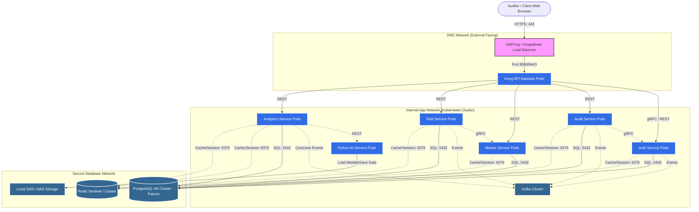
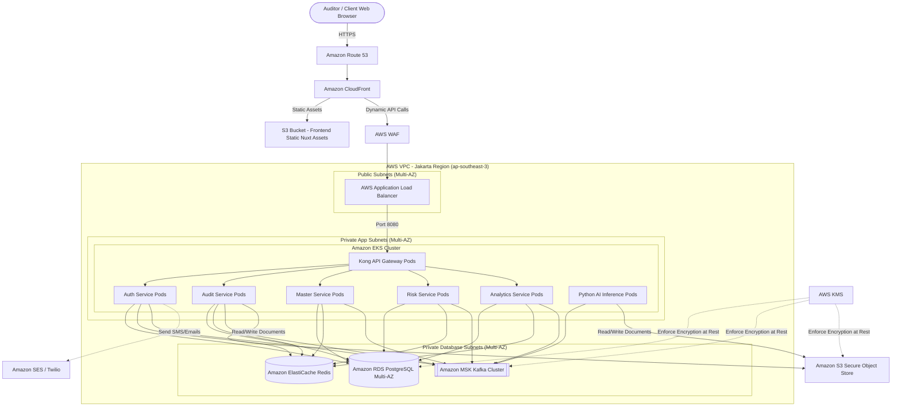
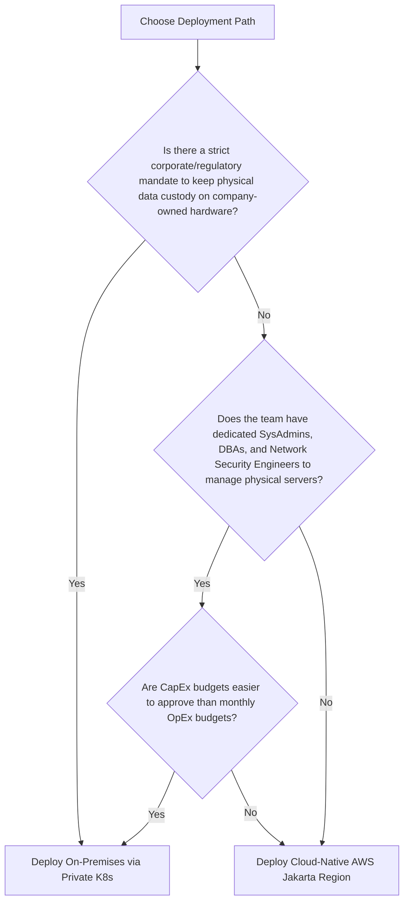

# Architectural Design: On-Premises vs. Cloud Deployment
## Risk-Based Internal Audit (RBIA) System

This document outlines the comparative architectural design for deploying the **Risk-Based Internal Audit (RBIA)** application on-premises versus on a cloud-native infrastructure. It is designed around the project's specific technologies, scale, SLA requirements, and regulatory compliance constraints.

---

## 1. System Technology Stack & SLAs Reference

To design the deployment architectures, we map out the application's components and their operational requirements:

### Component Stack
* **Frontend**: Nuxt 4 (Vue 3, Nuxt UI, Tailwind CSS)
* **API Gateway**: Kong Gateway (declarative mode, routing & auth enforcement)
* **Microservices (Go)**: `auth-service`, `audit-service`, `master-service`, `risk-service`, `analytics-service`
* **AI Service (Python)**: `python-ai` (FastAPI, XGBoost, TensorFlow, PyTorch, Scikit-Learn for risk prediction and anomaly detection)
* **Databases & Cache**: PostgreSQL 16 & Redis 7
* **Event Broker**: Apache Kafka & ZooKeeper (asynchronous auditing events, logs, analytics queue)

### Performance SLAs
* **Concurrent Users**: 100–1,000 active users (100 peak concurrent).
* **Search Query Speed**: < 5 seconds for 1 million audit records (leveraging Redis).
* **Batch Upload**: < 3 seconds for 10,000 records.
* **Dashboard Load**: < 2 seconds under high load.
* **Compliance**: GDPR, ISO 27001, and **Undang-Undang Perlindungan Data Pribadi (UU PDP)** (Indonesian Personal Data Protection law, requiring local data residency for certain sensitive records).

---

## 2. On-Premises Deployment Architecture

In an on-premises setup, the enterprise hosts the infrastructure in its own physical data center or private cloud. Given the containerized nature of the project (Docker/Kubernetes ready), we recommend a private Kubernetes cluster (e.g., **Rancher RKE2** or **MicroK8s** for enterprise-grade, lightweight orchestration).

### Hardware & Virtual Machine Requirements

To ensure High Availability (HA) and satisfy the SLAs, we require a minimum of 3 Physical Nodes (hypervisors running VMware ESXi or Proxmox) partitioned into virtual machines (VMs) across three logical tiers.

| Server / VM Role | Specs (Per Node) | Quantity | Purpose |
| :--- | :--- | :--- | :--- |
| **Load Balancer (HA)** | 2 vCPU, 4GB RAM | 2 VMs | Active-Passive Keepalived + HAProxy |
| **K8s Master Nodes** | 4 vCPU, 8GB RAM, 100GB SSD | 3 VMs | Kubernetes Control Plane |
| **K8s Worker Nodes (App Tier)**| 8 vCPU, 16GB RAM, 200GB SSD | 3 VMs | Hosts Nuxt frontend, Go microservices, Kong Gateway, and `python-ai` |
| **Database & Cache (State Tier)** | 8 vCPU, 32GB RAM, 500GB NVMe | 3 VMs | Dedicated VMs (outside or inside K8s) for Postgres & Redis |
| **Message Broker (Kafka Tier)** | 4 vCPU, 16GB RAM, 500GB SSD | 3 VMs | Kafka cluster brokers (ZooKeeper-less/KRaft mode or Kafka+ZK) |

### On-Premises Logical Architecture



### High Availability & Security Strategy (On-Premises)
1. **Load Balancing**: Two active-passive VMs running `Keepalived` sharing a Virtual IP (VIP), routing traffic to `HAProxy`. HAProxy terminates SSL/TLS and forwards traffic to the Kong API Gateway in Kubernetes.
2. **Kubernetes Orchestration**: Microservices are deployed as Kubernetes Deployments with Horizontal Pod Autoscalers (HPA) targeting CPU/Memory usage.
3. **Database High Availability**: PostgreSQL is set up using **Patroni** (consisting of 3 nodes: 1 Leader, 2 Replicas) with PgBouncer for connection pooling. This guarantees automatic failover and load balancing for read queries.
4. **Cache & Session HA**: Redis is deployed in a **Redis Sentinel** architecture (3 nodes) to ensure session data and search cache do not drop, keeping retrieval times under 5 seconds.
5. **Kafka Resilience**: 3 Kafka Brokers spread across physical hardware nodes, with `min.insync.replicas=2` to prevent data loss on event logs.
6. **Network Segmentation**: Segmented VLANs:
   * **DMZ**: Public/User-facing load balancers.
   * **App Zone**: Kubernetes node networks (inaccessible directly from the internet).
   * **DB Zone**: Strictly isolated database servers accessible only by the K8s Worker Nodes.
7. **Storage**: High-performance local SAN/NAS (SSD-backed) connected via Fiber Channel or iSCSI for fast read/writes on uploaded audit documents.

### 2.1 On-Premises AI Microservice Deployment (Air-Gapped & Offline Hosting)

Deploying Python Machine Learning workloads (using PyTorch, TensorFlow, and Hugging Face tokenizers like IndoBERT) onto a physical, on-premises client server introduces two main challenges: **Network Isolation (Air-gapping)** and **Compute Optimization (CPU vs. GPU)**. 

To run the `python-ai` microservice successfully in these environments, we implement the following strategy:

#### 1. Handling Air-gapping & Volume Shadowing
Enterprise on-premises servers are usually isolated from the internet (air-gapped) and cannot access Hugging Face or public model hubs to download pre-trained weights at runtime.
* **Pre-Baking Models in CI/CD**: We run `train.py` (which fetches IndoBERT and fits XGBoost, Isolation Forest, and LSTM models) *during the Docker image build phase* on a build machine with internet access.
* **Pre-trained Copy Restoration (Self-Healing Volume)**: Physical servers use Persistent Volumes or Host Mounts (e.g. Docker volumes or Kubernetes PVCs) mounted to `/app/models`. If a volume is empty, it hides the image's pre-baked folder. To fix this, we created an [entrypoint.sh](file:///Users/a/Projects/risk-based-audit/backend/python-ai/entrypoint.sh) script and updated the [Dockerfile](file:///Users/a/Projects/risk-based-audit/backend/python-ai/Dockerfile). On startup, it copies models from a backup folder (`/app/pretrained_models`) into the mounted volume if it is empty.

#### 2. Compute Optimization: CPU-only vs. GPU Acceleration
Depending on the physical client server hardware, choose one of these compute configurations:

* **Scenario A: Standard CPU Server (Default)**
  * TensorFlow and PyTorch default to CPU execution if no GPU is found.
  * In [train_lstm.py](file:///Users/a/Projects/risk-based-audit/backend/python-ai/train_lstm.py), we set `os.environ["CUDA_VISIBLE_DEVICES"] = "-1"` to disable CUDA lookups and prevent driver segmentation faults.
  * *Optimization Tip*: If physical servers are CPU-only, consider swapping torch/tensorflow with CPU-only wheels in `requirements.txt` to decrease the final Docker image size from ~6GB to ~1.8GB.

* **Scenario B: GPU-Enabled Server (NVIDIA Hardware)**
  * If the client server has an NVIDIA GPU, install the **NVIDIA Container Toolkit** on the host.
  * Expose the GPU to the container in `docker-compose.yml`:
    ```yaml
    services:
      python-ai:
        ...
        deploy:
          resources:
            reservations:
              devices:
                - driver: nvidia
                  count: 1
                  capabilities: [gpu]
    ```
  * In `Dockerfile`, change the base image from `python:3.10-slim` to a CUDA-supported runtime (e.g. `nvidia/cuda:11.8.0-runtime-ubuntu22.04` and install python) to allow torch and tensorflow to utilize CUDA cores.

#### 3. Offline Image Distribution Workflow
To transport and run the AI container on an offline client server:

1. **Build & Bake (On a machine with internet)**:
   ```bash
   cd backend/python-ai
   docker build -t rb-audit-python-ai:latest .
   ```
2. **Export to Tarball**:
   ```bash
   docker save -o rb-audit-python-ai.tar rb-audit-python-ai:latest
   ```
3. **Transfer to Server**: Transfer `rb-audit-python-ai.tar` via secure network (SFTP) or encrypted physical storage to the client's local server.
4. **Load & Run**:
   ```bash
   # On the physical target server
   docker load -i rb-audit-python-ai.tar
   docker compose up -d
   ```

---

## 3. Cloud-Native Deployment Architecture (AWS Example)

For a cloud-native approach, we map components to fully managed services to offload maintenance, scale dynamically, and leverage elastic resources. Since compliance with **Indonesian UU PDP** is required, the services should be hosted in a local cloud region, such as **AWS Jakarta (ap-southeast-3)**.

### Managed Service Mapping

| Component | Local / On-Premises | AWS Cloud Native equivalent |
| :--- | :--- | :--- |
| **DNS & CDN** | Local BIND DNS / Local CDN | Amazon Route 53 + AWS CloudFront |
| **WAF & Security** | Local Hardware Firewall / ModSecurity | AWS WAF + AWS Shield |
| **Load Balancer** | HAProxy / Keepalived | AWS Application Load Balancer (ALB) |
| **API Gateway** | Kong Gateway (Self-hosted) | Kong Gateway on K8s (EKS) or AWS API Gateway |
| **Container Hosting**| Kubernetes (Rancher / Upstream) | Amazon Elastic Kubernetes Service (EKS) on Fargate/EC2 |
| **Relational DB** | PostgreSQL 16 (Patroni Cluster) | Amazon RDS for PostgreSQL (Multi-AZ) |
| **In-Memory Cache** | Redis 7 (Sentinel Cluster) | Amazon ElastiCache for Redis (Serverless / Multi-AZ) |
| **Message Broker** | Kafka + ZooKeeper (Self-managed) | Amazon MSK (Managed Streaming for Kafka) |
| **File Storage** | local SAN / NAS | Amazon S3 (Standard + Glacier for long-term archiving) |
| **AI Workloads** | Python-AI inside K8s | Amazon SageMaker (for training) + ECS Fargate (for inference) |
| **Secrets & Keys** | HashiCorp Vault (Self-hosted) | AWS Secrets Manager + AWS KMS (Key Management Service) |

### Cloud Logical Architecture (AWS)



### High Availability, Elasticity, & Security Strategy (Cloud)
1. **Multi-AZ Availability**: All resources (EKS, RDS, ElastiCache, MSK) are deployed across multiple Availability Zones (minimum of 2, ideally 3) within the Jakarta region to ensure zero-downtime during zone failures.
2. **Auto-Scaling**: 
   * **EKS worker nodes** auto-scale horizontally using Cluster Autoscaler or Karpenter.
   * **Pods** scale via HPA based on concurrent user spikes.
   * **Serverless compute** (Fargate) handles unpredictable spikes in AI risk assessments or report generation without provisioning VMs.
3. **Database Scalability**: RDS PostgreSQL is configured with Multi-AZ (Active-Passive synchronous replication) for failover, with Aurora PostgreSQL Serverless v2 as an alternative for automatic storage and write/read capacity scaling.
4. **Enhanced Document Storage (S3)**: S3 offers 99.999999999% durability. Audit evidence documents, charts, templates, and interview reports are encrypted using KMS keys and versioned to prevent accidental overwrites.
5. **AI Compute Optimization**: Heavy Python model inference (BERT/LSTM/XGBoost models in `python-ai`) can run on GPU-enabled ECS nodes or SageMaker endpoints, which scale down to 0 when not in use to optimize run costs.

---

## 4. On-Premises vs. Cloud: Comparative Matrix

| Category | On-Premises Deployment | Cloud-Native Deployment (AWS) |
| :--- | :--- | :--- |
| **Capital Expenses (CapEx)**| **High upfront cost**: Must purchase servers, storage arrays, networking hardware, firewalls, and rack space. | **Zero upfront cost**: Pay-as-you-go. Pricing scales linearly with usage. |
| **Operational Expenses (OpEx)**| **Medium**: High electricity, cooling, server maintenance, and internal staff costs. Lower direct subscription fees. | **High / Variable**: Monthly cloud bills. Cost can balloon if resources are not monitored or optimized. |
| **Deployment & Setup Speed** | **Slow**: Takes weeks to months for server procurement, networking setup, hypervisor config, and cabling. | **Fast**: Cluster can be spun up in minutes/hours using Terraform/CloudFormation templates. |
| **Scalability & SLAs** | **Rigid**: Upgrades require buying more RAM/HDDs. Harder to meet immediate high-load demands if limit is reached. | **Highly Elastic**: Auto-scaling handles sudden concurrency spikes. Easily matches the 2s SLA for dashboards. |
| **Disaster Recovery (DR)** | **Expensive & Complex**: Requires a secondary physical site (DR site) with replica servers and databases. | **Simplified & Cheap**: Automatic Multi-AZ backups, cross-region replication, and automated database snapshot routing. |
| **Compliance (ISO 27001 / UU PDP)**| **Simplest Compliance**: Data never leaves the corporate walls. Easy to audit physical security. Fully complies with UU PDP. | **Compliant but Requires Guardrails**: Must ensure deployment is locked into the **Jakarta Region** to satisfy local data residency laws. |
| **Maintenance Overhead** | **High**: Infrastructure engineers must patch OS/hypervisors, replace failed disks, manage network switches. | **Low**: AWS handles hardware, hypervisors, and physical security. DBAs focus on queries rather than RDS OS patching. |

---

## 5. Deployment Architecture Recommendation

### Recommendation Breakdown

The optimal deployment path depends on **Data Security Governance** and **Operational Capacity**:



#### Option A: Deploy Cloud-Native (Recommended if no strict hardware mandates exist)
* **Why**: The RBIA system relies heavily on a complex ecosystem (PostgreSQL + Redis Sentinel + multi-node ZooKeeper/Kafka + intensive Python-AI libraries). Setting up, patching, and maintaining these 5 distinct infrastructure layers locally is a massive operational burden for a team of 100–1000 users.
* **Compliance Safeguard**: Deploy in the **AWS Jakarta Region (ap-southeast-3)**. Secure the VPC with security groups, encrypt databases via AWS KMS with client-owned keys, and keep all traffic within the private subnet. This fulfills UU PDP (Indonesian local data residency) and ISO 27001 while saving thousands in server management.

#### Option B: Deploy On-Premises (Mandatory if data must not leave physical company walls)
* **Why**: Financial institutions, military entities, or government agencies using the RBIA system often have strict mandates where cloud hosting is disallowed.
* **Implementation Strategy**: Package the entire system into a **Kubernetes Helm Chart**. Use **Rancher RKE2** to orchestrate Go services, Kong gateway, and Nuxt. Set up PostgreSQL and Redis on bare-metal VMs running on enterprise-grade SAN arrays to meet the performance SLAs for massive file uploads (10,000 records) and data searches (1 million audit records).

---

## 6. Infrastructure-As-Code (IaC) & CI/CD Roadmap

Regardless of the choice, the deployment should be automated to ensure consistency:

```
[Developer Push] 
       │
       ▼
[GitHub Actions / Jenkins] ──► Runs Linters, Unit & Integration Tests
       │
       ▼
[Docker Build & Push] ───────► Push images (Go microservices, Nuxt frontend, Python-AI) to Registry
       │
       ▼
┌────────────────────────────┴────────────────────────────┐
│                                                         │
▼ (Option A: Cloud)                                       ▼ (Option B: On-Premises)
[Terraform Apply]                                         [Ansible / Helm Upgrade]
  ├── Spins up AWS ALB, RDS, EKS, MSK                      ├── Updates deployments on Private K8s
  └── Deploys Helm charts to EKS                           └── Restarts Pods with zero-downtime rolling update
```

1. **Dockerization**: Keep using the `Dockerfiles` present in each service.
2. **Kubernetes Configuration**: Draft Kubernetes manifests (or a Helm chart) defining:
   * Deployments (replicas, resources constraints for CPU/RAM).
   * Services (ClusterIP for internal microservices, NodePort/LoadBalancer for Kong API Gateway).
   * Secrets (PostgreSQL passwords, JWT secret tokens, Kafka credentials) managed securely.
3. **CI/CD Integration**: Extend the GitHub Actions workflow in [BACKEND_RUN_AND_DEPLOY.md](file:///Users/a/Projects/risk-based-audit/docs/BACKEND_RUN_AND_DEPLOY.md) to build production-ready, slimmed-down Go binaries and container images, pushing them to a secure private registry (e.g., AWS ECR or Harbor for On-Premises).
